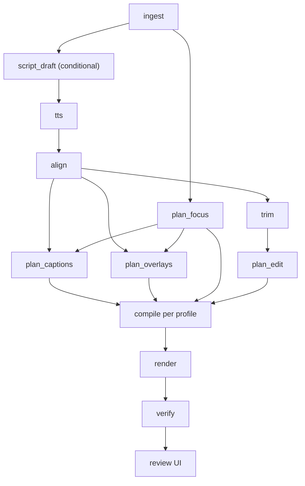

# screencut — Design & Architecture

Status: phases 1 to 9 built, plus phase 10's corpus — the spec (`spec/`), the Cap adapter and fixture generators
(`ingest/`), the deterministic planners `plan_focus`, `plan_captions` and `trim` plus the
model stages `script_draft`, `plan_edit`, `emphasis`, `plan_overlays` and the metadata
sidecar (`plan/`), open transcription, synthesis and forced alignment (`synth/`), the
FFmpeg compiler (`compile/`), verification through §9.2 (`verify/`), the runner, cache,
agent adapter, remote runner and job record (`runner/`), the review UI (`review/`) and the
golden-set replay harness (`golden/`). Of §10's three tiers only the hand-written one
runs; what phase 10 added early is the *corpus* the learner will read (`prefs/corpus.py`),
because recording is the one part of it that cannot be done retroactively. `screencut ingest <take>.cap --out <job>` turns a
recorder bundle into a job; `screencut narrate <job>` attaches a script and a voice
reference to one; `screencut run <job>` renders it to every profile, skips whatever the
cache already holds, verifies each render, diffs the rendered audio against what the edit
says should be there on a job with a transcript, and writes a metadata sidecar beside each
render. `screencut-review` serves the correction loop over the result; `make replay`
replays the golden set and reports per-field drift. Four things the design leans on have
still not happened, all for want of what is installed on the machine this was built on: no
*real* recording has been ingested, **no model has run** (every model stage has only ever
taken §7.4's degradation path or a scripted stand-in, so risk R5 has a meter and no
reading), §9.2 has never round-tripped speech, and no voice has been synthesized. See
A fifth thing has not happened for a different reason: **no job has been accepted**, so
§10's learner is unbuilt by design and `make corpus` says how far off its gate is. See
[`implementation-phases.md`](implementation-phases.md) for what is built and what is next.

## 1. What this is

A pipeline that turns a raw screen recording (or a still image) into publish-ready
video: narrated, captioned, auto-zoomed, reframed for multiple aspect ratios — with a
review loop that captures corrections as structured diffs and feeds them back as
learned preferences.

**In scope:** capture ingest, narration, captioning, auto-zoom/reframe, overlay
generation, rendering, automated verification, human review, preference learning.

**Out of scope:** recording itself (an external recorder produces the input), and
publishing (the pipeline ends at a file plus a metadata sidecar; posting is manual).

### 1.1 AI-edited, not AI-generated

This is the philosophy, and it decides more design questions than any other line in this
document.

**Every frame is captured.** What appears on screen is a real recording of a real screen,
cropped, zoomed, cut, captioned and annotated — never synthesized. There is no image
model, no video model, and no B-roll generator anywhere in this system, and adding one
would not be an extension of this design but a replacement for it.

The model's job is the job of an editor: decide what to cut, where to look, what to
emphasize, what to label, what to call the thing. Those are decisions *about* captured
footage. Producing footage is not on the list.

Two boundary cases, adjudicated once so they stop being arguments:

- **Written language is in scope.** `script_draft` produces words you then perform;
  the metadata sidecar produces copy for the post. Neither is media, and neither reaches
  a frame without passing through you.
- **Your synthesized voice is in scope** (decision #20). F5-TTS cloned from your own
  reference audio, reading your own script, is performance substitution — the same
  editorial act as a re-recorded pickup line, with the same author. A stock voice or a
  voice that is not yours would not be, and is not offered.

Overlays are the case that looks like generation and is not: a fixed template set filled
with text (§6.3) is a lower-third, which is editing furniture rather than invented
content.

Single user, single style. No multi-tenancy, no auth, no billing, no job queue beyond
what one person running one job at a time needs.

## 2. Decisions

Recorded so future-us knows what was chosen deliberately versus what merely happened.

| # | Decision | Choice | Consequence |
|---|---|---|---|
| 1 | Users | Single user, one style | No tenancy/auth/quota layers. Preferences are one directory. |
| 2 | Compute location | Undecided | Every heavy stage is a CLI contract behind a `Runner`. Only `LocalRunner` gets built. |
| 3 | Renderer | FFmpeg primary, MLT export | One renderer, no parity guarantee to maintain. See §6. |
| 4 | Correction capture | Web review UI editing the spec | Corrections are structural diffs, which is what makes §10 possible. |
| 5 | Cursor events | Available from recorder | Auto-zoom and reframing are arithmetic, not inference. See §4.3. |
| 6 | Outputs | 9:16, 16:9, both from one source, stills | Forces the two-layer spec in §4.1. |
| 7 | Language | Python core, Pydantic → JSON Schema → TS | One spec definition serves validation, the UI types, *and* LLM output constraint. |
| 8 | Script source | Supplied or AI-drafted | `narration.script` is optional; absence triggers a draft stage. |
| 9 | Publishing | File on disk | No platform APIs, no OAuth, no scheduling subsystem. |
| 10 | Fixtures | Synthetic first | Ingest is an adapter boundary. See risk R1. |
| 11 | Overlays | Generated from templates per video | SVG re-renders correctly across aspect ratios; a bitmap library would not. See risk R2. |
| 12 | Autonomy | Full auto, review the finished render | Fastest feedback per job; cleanest diffs. Costs compute on bad scripts. |
| 13 | LLM interface | A coding-agent CLI, not a provider SDK | No SDK dependency, no key handling here, model is a flag. Costs constrained decoding. See §7. |
| 14 | Captions | Plain blocks first, kinetic later | Spec carries word timings from day one; only the compiler changes later. See §6.2. |
| 15 | Review UX | Form + re-render; overlay preview later | Puts the whole weight on the stage cache. See §8. |
| 16 | State | SQLite + files on disk | Media in per-job directories, records and cache index in SQLite. See §5.4. |
| 17 | Hardware | M1 MacBook Air, 8GB, fanless | 8GB is the ceiling: one model resident at a time, local stages serialized. ASR backend swappable; VideoToolbox for encode. See §16. |
| 18 | Content origin | Every frame is captured, never synthesized | No image, video, or B-roll model exists in this design. See §1.1. |
| 19 | Editorial decisions | Arithmetic proposes, the model reviews and tiers | `trim` is deterministic; `plan_edit` overrides it and ranks. Gives §7.4 a decent floor. See §4.4. |
| 20 | Voice | F5-TTS cloned from your own reference audio | Performance substitution, not content generation — the one synthesis this design allows, and only of you. See §1.1. |
| 21 | Cuts vs aspect | Segments tiered once, selected per profile by duration budget | Keeps cuts aspect-agnostic without claiming two aspects want the same edit. See §4.4.1. |
| 22 | Edit application | `EditDecisions` is projected at compile, never baked into the spec | Everything stays in source time; a cut correction costs a re-render, not a re-plan. See §4.5. |
| 23 | Golden replay | Checked by field origin — strict deterministic, distributional model | One tolerance cannot serve both without becoming useless for the strict half. See §11.1. |
| 24 | Sources | One recording per job | Multi-take assembly is a schema *and* compiler change; §4.2 absorbs it if wanted. See §4.1. |

## 3. Principles

Principle 0 is §1.1 — the footage is captured, the model edits it. The four below are how
that gets enforced in code rather than asserted in prose.

1. **The spec is the system.** Planner, renderer, verifier, review UI, and learner all
   read and write one versioned document. Everything else is a detail.
2. **The model proposes; deterministic code disposes.** LLM stages emit typed,
   schema-validated spec fragments. They never emit FFmpeg arguments, never emit
   coordinates in pixels, and never render anything.
3. **Prefer arithmetic to inference.** Where a decision can be computed from data
   (cursor events, audio levels, word timings), compute it. Reserve the model for
   decisions that are genuinely about taste or language.
4. **Every stage is cacheable and replayable.** The review loop is iterative by design.
   If a caption tweak re-synthesizes the voiceover, corrections become expensive and
   the loop dies.

## 4. Core data model

### 4.1 Two layers

Producing 9:16, 16:9 and stills from one source makes a single flat spec impossible.

**`EditSpec`** — aspect-agnostic. **One source**, `EditDecisions`, `FocusTrack`, narration
segments with word timings, emphasis markers, overlay intents, audio levels. All spatial
values normalized to `0.0–1.0` in source coordinates. All temporal values in seconds
from source start. **No pixels anywhere.** This is what the planner produces, what the
review UI edits, and what the learner diffs.

One source, singular and deliberate (decision #24). A job is one take. Assembling several
takes is a real editing operation and a plausible future want, but it is a schema field
*and* a compiler change, and it is not needed to find out whether any of the rest of this
works. §4.2's migration registry is what makes adding it later ordinary rather than
alarming — the same reasoning R1 applies to the recorder: build on the floor, extend when
the floor turns out to be higher.

**`RenderProfile`** — `shorts_9x16`, `demo_16x9`, `still_4x5`. Resolution, framerate,
safe-area insets, caption box geometry and type scale, encode settings, a
`duration_budget`, and two projection rules: the one that turns a `FocusTrack` into zoom
keyframes or a crop path, and the one that turns tiered `segments` into a duration
(§4.4.1). A profile carries **two** projections because a render differs from its source
in space *and* in time.

One `EditSpec` × N `RenderProfile` = N renders.

Preferences are learned **per profile**. Caption Y in vertical is a different number from
caption Y in widescreen; a single global default averages them into a value wrong for
both.

### 4.2 Versioning

`EditSpec` carries `spec_version` from the first commit, with explicit migration
functions between versions. The golden set (§11) will outlive several schema changes,
and v1 golden specs that no longer load are a golden set silently lost.

### 4.3 FocusTrack

A time series of `(t, x, y, weight, kind)` in normalized source coordinates, where
`kind` distinguishes movement, click, dwell, and manual annotation.

This single structure serves all three output types:

- **16:9 demo** — cluster clicks in time and space; emit zoom keyframes over dwell regions
- **9:16 short** — the same track becomes a crop path; vertical reframing of a widescreen
  recording is largely solved once attention position is known
- **Stills** — no cursor, so a saliency pass (or a manual point) yields a track of one or
  two entries, and Ken Burns is a pan along it

Modelling this as `FocusTrack` rather than "cursor zoom" is what makes the photo path
the degenerate case of the video path rather than a parallel implementation.

Planning from a `FocusTrack` is deterministic, governed by a handful of tunables:

| Tunable | Role |
|---|---|
| `zoom_factor` | Magnification at a dwell region |
| `min_dwell_ms` | Ignore transient cursor passes |
| `min_gap_ms` | Suppress rapid zoom oscillation |
| `ease_ms` | In/out transition duration |
| `crop_lag` | How far the 9:16 crop trails the focus point |
| `max_crop_delta_per_frame` | Ceiling that prevents judder |

Every one is a scalar the preference store can learn by median. No model participates in
the highest-impact *spatial* decision in the pipeline.

### 4.4 EditDecisions

Where `FocusTrack` answers "where do we look", `EditDecisions` answers "what survives".
It is the other half of the `EditSpec`, and under §1.1 it is the part that makes this an
editing tool rather than a captioning tool.

Two fields. Both are in **source time**, like everything else in `EditSpec` (§4.1), and
neither is applied until `compile` — see §4.5, which is the part that makes the review
loop affordable.

**`removals`** — ranges that never survive, in any profile. Silence, dead air, filler
words, false starts. `(t_in, t_out, kind)` where `kind` is `silence`, `filler`,
`false_start`, or `redundant`. Removal is expressed as a range rather than as rewritten
text, and that is what keeps this an edit: the audio and the caption are cut at the same
instants, from the same decision, and nothing is put into your mouth that you did not
say.

**`segments`** — the surviving content, each carrying a **tier**: `essential`,
`supporting`, or `optional`, plus a `reason`. Tiers are not cuts. They are a ranking, and
which of them survive is decided per profile (§4.5).

Together they **partition the source**: every second is either in a removal or in a
segment, with no gaps and no overlaps. That totality is a schema-level invariant, not a
convention — it is cheap to check and it catches a whole class of model error before
anything renders (§9.1).

### 4.4.1 Why tiers rather than cuts

A 60-second demo and a 20-second short are not the same edit. Cuts are the most
aspect-*dependent* decision in the system, and putting a single cut list in the
aspect-agnostic layer would assert they are the same.

Tiering separates the two decisions that were tangled together:

- **How good is this bit?** Aspect-independent, taste, done once by `plan_edit`.
- **How much fits?** Aspect-dependent, arithmetic, done per profile.

`RenderProfile` gains a `duration_budget`, and the projection rule is: include every tier
at or above the highest threshold that fits the budget. Three tiers, three possible
selections, no search. `shorts_9x16` lands on `essential`; `demo_16x9` typically takes
everything.

This is the §4.3 pattern applied to time. `FocusTrack` is rated once and projected per
profile into a crop path or zoom keyframes; `segments` are rated once and projected per
profile into a duration. One spec, N renders survives intact (decision #6), the
per-profile decision stays arithmetic (principle 3), and the budget is a scalar the
preference store can learn per profile — which is exactly the argument §4.1 already makes
for caption geometry.

When `essential` alone overruns the budget, the profile cannot be satisfied. That is a
verification finding with a number attached, not a crash and not a silent overrun (§9.1).

### 4.5 Cuts are a projection, not a rewrite

`EditDecisions` is **never applied to the spec**. Captions, overlays and the `FocusTrack`
all stay in source time, and `compile` performs the removal-and-selection as part of
producing the filter graph — remapping timings, splitting caption blocks at boundaries,
and dropping overlays anchored inside removed ranges.

This is the same discipline §4.1 already applies to space. Nothing commits to a
coordinate system until the compiler projects it, and time is a coordinate system.

Three things fall out, and the third is the reason this matters:

1. **Nothing downstream of `align` depends on `plan_edit`.** `plan_captions` and
   `plan_overlays` run parallel to it, against the full source timeline.
2. **Caption trimming is free.** §6.2 already carries per-word timings for kinetic
   captions; trimming a block to a range is a word-level operation on data that is
   already there. The field that existed for a later phase turns out to be what makes
   this one deterministic.
3. **Adjusting a cut in review re-runs `compile` and `render`, and nothing else.** If
   cuts were baked into the spec instead, moving one boundary would re-plan captions and
   overlays — and `plan_overlays` is a model call. That would put a model call behind
   every cut correction, which is precisely the failure §8 says kills the review loop.

The cost is that `plan_overlays` sees material that will later be cut and may waste an
overlay on it. Compile drops it deterministically. A wasted overlay is worth a stage
dependency removed.

**There is no second time base, and there was nearly one.** Some elements are laid over
the *output* rather than derived from the source — a music bed, a progress pill (§6.3) —
and they look like they need output-relative timing, which would put an exception into an
invariant the whole design now leans on.

They do not. Anything spanning the whole output needs no anchor at all: the bed plays from
zero to the end of whatever compile produced, and the pill's value is computed from output
duration at compile. Anything positioned at a *moment* is positioned relative to content,
which is a source-time anchor that compile maps like every other. The invariant holds
without a carve-out: **`EditSpec` is source-anchored, without exception, and
output-relative behaviour is derived at compile from the projection.**

### 4.6 Deterministic trim tunables

The `trim` stage (§7.1) proposes `removals` by arithmetic, governed by scalars in the
same manner as §4.3:

| Tunable | Role |
|---|---|
| `silence_db` | Level below which audio counts as silence |
| `min_silence_ms` | Shortest gap worth removing — below this it is a beat, not dead air |
| `keep_pad_ms` | Padding retained either side of a removal, so cuts do not clip breath |
| `filler_words` | The closed list. A list, not a model. |

Every one is learnable by median under §10, and every one is a scalar you can also just
set by hand when a job needs it.

## 5. Pipeline



`plan_focus` has no audio dependency and runs parallel to TTS. Everything else waits on
`align`, because narration timing drives caption timing and edit pacing.

`trim` and `plan_edit` run **parallel to** `plan_captions` and `plan_overlays`, not ahead
of them. Everything works in source time and only `compile` applies the edit (§4.5). The
fan-out after `align` is the shape that makes a cut correction cost a re-render instead of
a re-plan.

### 5.1 Stage contract

Each stage is a pure function `(inputs, params) -> artifact`, exposed as a CLI taking
JSON on stdin and file paths as arguments. This is the seam that defers decision #2:
`LocalRunner` shells out to a subprocess; `RemoteRunner` ships inputs to a worker and
retrieves outputs. Pipeline code is identical under both.

`LocalRunner` was the only one built until phase 0 measured F5-TTS at 0.11x realtime on
the target machine. `RemoteRunner` arrived in phase 8 for that one stage, and what it
tested for the first time is the property this section has claimed since phase 3: a stage
sees only its job directory, and a remote run sends only the parts of it that are inputs.
The transport is an interface with one implementation — a workspace on a filesystem this
machine can see — because a transport written against a worker nobody has is the same
mistake as a parser written against output nobody has seen.

The seam is also what makes decision #13 cost nothing: an LLM stage is a subprocess that
happens to be a coding agent, sitting alongside the subprocesses that happen to be FFmpeg
and Whisper. There is no separate inference path in this codebase, and no second
mechanism to maintain. See §7.3.

### 5.2 Caching

Content-addressed, keyed on `(stage_name, input_hash, params_hash)`. Non-negotiable — see
principle 4.

**Retention.** Content-addressed and nothing evicts it is the right default on a large
disk and the wrong one on 256GB (§16). Every correction cycle in review writes another set
of stage artifacts, and the media ones are the large ones. The policy when the disk first
complains: artifacts reachable from a job's current spec are kept, superseded artifacts are
evicted oldest-first and re-derived if ever wanted again, and job media and `accepted_specs`
are never touched — they are inputs and corpus, not cache. Nothing needs building now; the
design only has to make it possible, which content-addressing plus the `stage_cache` table
already does.

For LLM stages, `params_hash` **must include the model identifier and a prompt version**.
The same transcript under a different model, or under a revised prompt, is a different
artifact; a key that omits them serves a stale result after exactly the change you were
trying to evaluate. This is the one cache subtlety that will not announce itself — it
looks like the prompt edit had no effect.

### 5.3 The two ASR calls are different

Conflating them is a real bug waiting to happen.

**`align`** runs **forced alignment** against the known script text. F5-TTS does not return
reliable word timestamps, so alignment is required even when the script was supplied.
Because the text is ground truth, this is substantially more accurate than open
transcription.

Phase 8 built it, and not with WhisperX. WhisperX was never run on the target machine —
phase 0 benchmarked three other backends — and a parser for output nobody has seen is the
failure phase 0 exists to prevent. So `align` open-transcribes the narration with
whisper.cpp and anchors the script to what came back, interpolating the runs between
anchors: the two sequences are nearly identical by construction, which makes this
arithmetic over an edit distance rather than an acoustic model (principle 3). WhisperX
remains the upgrade behind the same stage contract. **The script wins the word and the
audio wins the timing** — keep whisper's words instead and §9.2 below is comparing the
render against a transcript of itself.

**`verify`** runs **open transcription** on the *final rendered audio* and diffs against the
script. Same library, opposite purpose: one produces timings, the other independently
checks that the render did not lie.

There is a third call, and phase 4 is where it appeared: **`transcribe`** runs open
transcription on the *source* audio, which is what a recording narrated in your own voice
needs and what `align` cannot do, having no script to align to. It lives in `synth/asr.py`
beside where `align` will; keeping them separate modules producing separate artifacts is
this section's warning made structural rather than restated.

### 5.4 Persistence

Media and artifacts are files, in per-job directories. Records are rows, in SQLite.

```
data/
  jobs/<job_id>/
    source/        raw take, sidecar events
    stages/        per-stage outputs, named by cache key
    renders/       final files + metadata sidecars
    spec.json      current EditSpec
    spec.proposed.json
  screencut.db
```

SQLite holds four things, none of them large:

| Table | Purpose |
|---|---|
| `jobs` | Job record, status, spec version, degradations recorded by §7.4 |
| `stage_cache` | Cache key → artifact path, so lookup is a query and not a directory walk |
| `accepted_specs` | The learning corpus: accepted `EditSpec`s with the whole `RenderProfile` they were accepted under, not its name — every tunable §10 moves is a profile field and none is in the spec |
| `pref_changes` | Changelog of every learned-default move and the jobs that caused it (§10.1) |

Never put media in the database. The reason for having one at all is that both the
learner and the review UI want queries — "median `zoom_factor` over the last 20 accepted
jobs in `shorts_9x16`" is a query, and retrofitting a database once the golden set matters
is worse than starting with one.

## 6. Rendering

### 6.1 One renderer

**FFmpeg is the only renderer.** `compile` turns `EditSpec + RenderProfile` into a filter
graph. Zoom and crop become `zoompan`/`crop` driven by the projected `FocusTrack`; captions
burn in from generated ASS; overlays composite from template-rendered PNGs; audio ducking
and loudness normalization run in the same graph.

Two mechanisms, because the two projections are different shapes. A crop path is sampled,
so it is computed per frame and delivered through `sendcmd` to a `crop` whose window is a
constant size — which also keeps §9.1's judder check about motion rather than scale. A zoom
is a few eased regions, which is analytic, so it stays an expression; `zoompan` takes no
commands and is the only filter that can hold a window whose size varies. The same command
stream carries overlay positions and the progress pill's fill, so an overlay follows the
point it labels through whatever the frame is doing.

Ducking is arithmetic too. The bed is driven by `asendcmd` from the word timings the spec
already carries, rather than by a compressor listening to the narration — which makes
`duck_db` the number it says instead of a setting that produces approximately that.

**MLT XML is a one-way export, not a second renderer.** When a job needs something the
spec cannot express, export to MLT, hand-edit in Kdenlive, and re-ingest the modified XML
back into an `EditSpec`. There is deliberately **no parity guarantee** between the MLT
export and the FFmpeg render — declaring one would mean maintaining two renderers and
debugging their divergence forever. The review UI is the normal correction path;
Kdenlive is the escape hatch.

### 6.2 Captions

`plan_captions` emits `CaptionBlock`s that **always carry per-word timings**, because
`align` produces them anyway and the cost of carrying them is zero.

The first compiler renders plain timed ASS blocks and ignores the word array. Kinetic
word-highlight rendering is a later, purely-compiler-side phase: per-word ASS override
tags with active-word colouring. Because the spec already carries the data, that phase
changes no schema, invalidates no golden specs, and needs no migration.

Those word timings turned out to have a second use nobody planned for. §4.5 needs
`compile` to trim a caption block to a time range when a cut lands inside it, and per-word
timings make that a deterministic word-level operation rather than an estimate. A field
carried for a later phase is what makes an earlier one exact — which is the argument for
this shape better than any reasoning about kinetic captions.

This is the general shape to aim for — **model the end state, render the simple case** —
and it is why the load-bearing milestone in the phase plan does not have hand-authored per-word ASS
timing in its path.

### 6.3 Overlays

Overlays are **parameterized templates**, not free-form generation. A small fixed set —
callout arrow, highlight box, label chip, progress pill — rendered deterministically from
SVG to PNG at the target profile's resolution.

The LLM chooses *template + anchor + text*. It does not invent layouts. Free-form
generation would be unpredictable, untestable, and unlearnable, and under full autonomy
(#12) every instance would be discovered at review time.

## 7. LLM stages

Interface: **a coding-agent CLI** — [`hoocode`](https://github.com/kolisachint/hoocode) —
invoked through the §5.1 stage contract like any other executable (decision #13). This
codebase carries no provider SDK, no API key handling, and no bespoke inference layer.
Model selection is a flag on the subprocess, so switching models is a config change and
not a code change.

### 7.1 Which surfaces use a model

The full surface survey, not only the stages that say yes. A "no" in this table is a
design commitment that something stays deterministic — it is load-bearing, and worth as
much as the yeses.

| Surface | Model? | Rationale |
|---|---|---|
| Ingest / recorder adapter | No | Format translation. Writing the adapter is agent work; running it is not. |
| `plan_focus` | No | Arithmetic over `FocusTrack` (§4.3) |
| `trim` — silence, dead air | No | Level and duration thresholds (§4.6) |
| `trim` — filler words | No | A closed word list against the transcript. A list is not a model. |
| `plan_edit` — reviewing the trim | **Yes** | Whether a silence was a beat is taste, even though finding it was arithmetic |
| `plan_edit` — false starts, restarts | **Yes** | Language |
| `plan_edit` — segment tiers | **Yes** | What is worth keeping is *the* editorial decision (§4.4) |
| `script_draft` | Yes | Language |
| `align` | No | Forced alignment (§5.3) |
| `plan_captions` — timing, layout | No | Derived from `align` output and profile geometry |
| Emphasis word selection | Yes | Taste |
| `plan_overlays` — template, anchor, text | Yes | Taste, bounded by the template set (§6.3) |
| Audio levels, ducking | No | Loudness measurement |
| `compile` | **Never** | Principle 2. No model emits an FFmpeg argument. |
| Deterministic checks (§9.1) | No | Arithmetic — and a check a model can talk its way out of is not a check |
| Transcript diff (§9.2) | Diff no, triage yes | Producing the diff is deterministic; judging a difference benign is not |
| Perceptual checks (§9.3) | Yes | Vision, and only for what text cannot answer |
| Metadata sidecar | Yes | Language |
| Review UI | No | Corrections are structural diffs — that is the entire point of §8 |
| Preference learner (§10) | No | Statistics. Auditability beats marginal accuracy. |
| Golden replay (§11) | No | Field diff with per-field tolerances |

`trim` and `plan_edit` carry most of the product's weight, and the split between them is
principle 3 applied honestly. Finding a silence is a threshold comparison. Finding an
"um" is a lookup. Neither deserves a model, and giving them one would have made the
degradation path in §7.4 far worse than it needs to be.

**Arithmetic proposes, the model reviews.** `trim` emits proposed `removals`; `plan_edit`
receives them alongside the transcript and may reject any of them, add its own, and
assign tiers. The reason the model sees the proposal rather than being kept away from it:
a two-second gap can be dead air or a deliberate beat, and only one of those is
removable. Arithmetic cannot tell them apart and should not be the last word.

The cost is honest — a model that can override a correct trim can also override it
wrongly, where a strict split could not. That is bounded by §9.1 and visible in review,
and it is worth paying for the beat.

### 7.2 Schema in, validated fragment out

The spec is Pydantic, so every LLM stage is the same shape: emit the JSON Schema for the
target fragment into the prompt, run the agent, parse stdout, validate against the model
that produced the schema.

```
prompt  = system + constraints.yaml + exemplars + json_schema(OverlayPlan) + job content
stdout  = hoocode -p --mode json ...
fragment = OverlayPlan.model_validate_json(extract_result(stdout))
```

One definition still does four jobs — it constrains what the prompt asks for, validates
what comes back, generates the review UI's TypeScript types, and defines what the learner
diffs.

**A fragment is intent, not the finished document.** This started as `plan_edit`'s
special case and turned out to be the general rule: **a fragment's schema cannot see the
document the fragment will join, so it is never the last word on validity.** `OverlayPlan`
makes the point most sharply — an overlay running from 55s to 61s is a well-formed
`OverlayIntent` and an invalid `EditSpec`, because only the spec knows the source is 60
seconds long. A stage that returned it would *succeed* and kill the job at apply time,
which §7.4 forbids. So every model stage writing into `EditSpec` ends in a `reconcile`:
clamp what is out of range, drop what is degenerate, derive what is arithmetic, and let
the model decide only what taste decides.

`plan_edit` returns removals and
tiered segments as ranges it cares about; `EditDecisions`'s totality (§4.4) is then derived
from them deterministically — removals win, segments are clipped to what is left, and
anything untiered stays `essential`. Asking a language model to land a gapless,
non-overlapping cover of exactly `[0, duration]` in float arithmetic buys a retry on
nearly every call and no editorial gain. The invariant still holds by construction; it is
arithmetic rather than the model that holds it, which is §4.5's discipline one level up.
The same reasoning is why `Removal.proposed_by` is derived from overlap with `trim`'s
proposal rather than reported by the model: the §9.1 override rate is a number about the
model, so the model does not get to write it.

**The honest cost of decision #13** is that the schema is now a strong instruction rather
than a decoding constraint: the agent *can* return something invalid, where a
constrained-decoding API could not. The mitigation is three lines of control flow, not a
subsystem — validate, retry once with the validation error appended, then degrade per
§7.4. Since §7.4 already mandates that degradation path for every stage, an invalid
fragment costs one extra round trip and lands somewhere the design already handles.

What is genuinely given up alongside it: provider-side prompt caching and batch
submission. For one person running one job at a time, both were cost optimizations on an
already-negligible bill.

### 7.3 Running an agent as a pipeline stage

A coding agent is built to explore and modify a repository. As a pipeline stage it must do
neither, and the invocation has to enforce that rather than request it:

- **Print mode, JSON events** — `-p --mode json`, so output is parseable and the process
  exits rather than waiting on a terminal.
- **Tools off, read-only mode.** A stage that plans captions has no business holding
  `write`, `edit`, or `bash`. hoocode's mode config (`enabled_tools`,
  `allowed_write_paths`) is where this is pinned.
- **Fixed cwd**, pointed at the job directory and nothing above it.
- **Everything the stage needs is in the prompt**, because with tools off there is no
  second way to get it.

This is a narrower thing than the agent is capable of, deliberately. The agent's full
range is for *building* screencut, which is a different activity from *running* it.

**Model and timeout are per stage, not per pipeline.** §7.1's surfaces differ in how much
thinking they deserve — picking a template and a point out of a closed set is not writing
the words you will perform — and under decision #13 that difference is a line of YAML
rather than a code change. `prefs/constraints.yaml` carries one default plus sparse
overrides, the same shape as its profile overrides and for the same reason.

**The prompt version in §5.2's cache key is derived from the prompt.** Phase 5 spelled it
as an integer to bump by hand, which works while there is one prompt and fails in two
directions once there are five: forget the bump and the cache serves the old answer to the
new prompt, share the integer across stages and editing one prompt re-runs the others. It
is a hash of the instruction text, so it cannot be forgotten and cannot be shared.

### 7.4 Failure handling

An LLM stage failure must not fail the job. Each degrades to a deterministic default and
records the degradation in the job record so review shows it. Verification still runs.

| Stage | Degrades to |
|---|---|
| `plan_edit` | `trim`'s proposed `removals`, every segment `essential` |
| `script_draft` | Job halts — there is no script to fall back to |
| `tts` | Job halts — same reason, one step later: there is no narration to fall back to, and a silent render looks finished |
| Emphasis | No emphasis markers |
| `plan_overlays` | No overlays |
| Metadata sidecar | Script-derived title and description |

**The first row is why the `trim` split earns its place.** Before it, a failed `plan_edit`
degraded to "keep everything" — the unedited take this project exists to avoid. Now it
degrades to a silence-trimmed, filler-stripped video: not the edit you wanted, but a real
one. The deterministic floor is decent, which means the model is adding polish rather than
carrying the feature alone, and risk R4 is correspondingly milder.

Failure here means any of: nonzero exit, unparseable stdout, schema validation failing
twice, or a timeout. Collapsing them into one "the stage did not produce a fragment"
branch is deliberate — with a subprocess boundary there is no typed exception hierarchy to
discriminate, and every one of these has the same correct response.

**A degraded artifact is not cached.** The fallback is what the stage produced *because it
could not run*, and §5.2's content-addressing would otherwise serve it forever: one lost
network, and every later run returns the degraded edit with the network back up and
nothing to indicate why. The artifact file is still written, so the job finishes; the
missing `stage_cache` row is what makes the next run try the model again.

The corollary is worth stating because it looks like a bug: **on a machine with no agent, a
job never reaches "nothing to do".** Every model stage degrades on every run, so every run
re-attempts them. That is the rule working — install the agent and the next run must use
it — and it is why the cache tests script an agent rather than asserting a cache hit over a
pipeline where no model stage could run at all.

The degradations are chosen so that a fully-degraded job still renders: the full take, the
verbatim transcript, plain captions, no overlays. That is a worse video, not a failed one,
and it is reviewable — which matters under decision #12, where degradation is discovered
at review time rather than at a stage gate.

### 7.5 Golden-set replay

Replaying the golden set (§11) through the LLM stages is a batch of independent
subprocesses with no shared state — parallelize across cores and rate-limit to whatever
the configured provider tolerates. Nothing more sophisticated is warranted at this
corpus size.

This parallelism is specific to the model stages, and it is safe precisely because they
hold no local weights. Local-inference stages are serialized on this machine (§16), so a
replay that includes them is a different, slower shape of job.

## 8. Review UI

FastAPI serving a single page per job: the rendered video for each profile, the proposed
`EditSpec` as an editable form, and a re-render button.

Corrections are field edits. Committing writes a corrected spec, re-runs only the
invalidated stages, and re-renders. **This design puts the entire burden on the stage
cache** — if a caption-position tweak re-synthesizes narration, the loop is unusable and
the corrections that feed §10 stop happening. Cache correctness is a review-UI
requirement, not an optimization.

**What a correction costs, stated precisely.** No planner re-runs: the edit is not
re-decided, which is §4.5's whole payoff and what makes a cut correction a re-render rather
than a re-plan. One stage that *is* model-backed does re-run, and it should — the metadata
sidecar (§7.1) describes what a viewer of this render hears, so a correction that changes
what is said makes the copy about it stale. Serving the old sidecar would be §5.2's silent
failure in the one place a person would actually read it. So the honest cost is one
compile, one encode, and one model call per profile when the words changed; corrections
that move a crop or a caption box cost no model call at all.

### 8.1 A correction is a layer, not an edit of the spec

The obvious implementation — write the corrected fields into `spec.json` — is wrong, and
wrong silently. The planners rewrite exactly the fields review edits, and §5.2 caches them
by what they *read*: `plan_edit`'s fingerprint is the focus track and the source duration,
so re-tiering a segment does not invalidate it, and the next run applies the cached
fragment straight back over the correction. The reviewer's decision would survive until
the next render and then vanish with nothing said.

So corrections live in `corrections.json` beside the spec, and the pipeline applies them
**after** the job-level stages have folded their artifacts in. The same discipline as
`constraints.yaml` over the built-in profiles (§4.1) and `EditDecisions` over the timeline
(§4.5): state the difference, apply it last, keep the thing it differs from intact.

Three things follow, and all three are load-bearing:

- **The proposal survives.** While a correction exists, `spec.json` is what rendered and
  `proposed.json` is what the planners said. §10 learns from the difference between two
  documents, so a correction that changes nothing produces no change to learn from.
- **Corrections address content, not indices.** A removal by its span, a segment by where
  it starts. An index into a list the model rewrote means something else afterwards, and
  silently means it.
- **A correction the plan no longer contains is refused, not skipped.** Dropping one
  quietly is the same failure as overwriting it. When the plan really has moved
  underneath a correction, the reviewer is told rather than shown a video that ignores
  them.

Withdrawing a correction restores the proposal, so taking one back is as complete as
making one.

A later phase adds static-frame overlay preview: scrub to a frame, see captions and
overlays composited on canvas, drag to reposition, re-render only for motion and audio.
Deferred deliberately — which corrections are made most often is not yet known, and
building the preview before knowing that optimizes the wrong interaction.

Full live preview is explicitly not a goal. That is a browser NLE, which is more work
than the rest of this pipeline combined.

## 9. Verification

Three layers. The first two exist to keep garbage from reaching a person.

### 9.1 Deterministic

- Render exit clean; duration within tolerance of the spec
- Integrated loudness −14 LUFS, true peak below −1 dBTP, dialogue-to-bed ratio above threshold
- Caption blocks: no mutual overlap, minimum display duration, maximum characters per line,
  fully inside the profile's safe area
- Overlay anchors inside safe area and not occluding a caption box
- **Crop-path continuity** — no crop delta above `max_crop_delta_per_frame`
- **Edit integrity** — `removals` and `segments` partition the source exactly: inside
  bounds, non-inverted, non-overlapping, no gaps. The selected tiers' total duration
  matches the rendered duration. This is the arithmetic half of trusting §4.4 — it cannot
  tell you a cut was tasteful, but it can tell you the model did not hallucinate a moment
  that was never recorded, and totality means it cannot quietly lose one either.
- **Budget satisfaction** — per profile, whether the selected tiers fit `duration_budget`.
  `essential` alone overrunning the budget is the expected way this fails (§4.4.1), and it
  is reported with the overrun in seconds rather than silently rendering long.
- **Trim override rate** — what fraction of `trim`'s proposed removals `plan_edit`
  rejected. Not a pass/fail; a number on the report. A model rejecting nearly all of them
  is either right about your recording style or has stopped reading the proposal, and both
  are worth seeing before the learner starts averaging over it.

That last check earns its place: judder is *the* failure mode of automated vertical
reframing, it is invisible in a still frame, and it is catchable with arithmetic.

### 9.2 Objective semantic

Open-transcribe the rendered audio and diff against the script (§5.3). One check that
catches TTS mispronunciation, audio/video desync, a wrong take, truncated narration, and
captions that drifted — all otherwise invisible until a human watches.

**§4.4 changes what this diff means, and the check has to know it.** Once `plan_edit`
removes disfluencies and cuts segments, the rendered audio is *supposed* to differ from
the raw transcript. Diffing against the raw transcript would flag every successful edit as
a failure, and a check that fires on correct behaviour gets ignored within a week.

So the diff runs against the **expected transcript**: the source transcript minus
`removals`, minus every segment below this profile's tier threshold. That is a
deterministic computation over the spec — no model, no guesswork — and it is
**per profile**, since two profiles select different tiers and therefore expect different
audio. Differences then fall into three classes:

| Class | Meaning |
|---|---|
| Matches expected | Pass |
| A range `EditDecisions` accounts for | Expected — the edit worked |
| Anything else | Real failure — mispronunciation, desync, truncation, a cut that landed wrong |

The third class is what this check exists for, and it now also catches a failure mode that
did not previously exist: a cut applied at the wrong instant, which clips a word. That is
invisible in a still frame and audible immediately.

The second class needs saying precisely, because it has a wrong reading that looks right.
It does **not** mean that removed material turning up in the render is expected — audible
removed material means the cut did not happen, which is the loudest failure this check can
find. It means the **seam**: a splice joins two stretches of audio that were never
adjacent, so the word on either side of it can lose its onset or its tail and be misheard.
A difference within one word-onset of a cut is the edit working; a difference anywhere else
is the third class. The end of the timeline is deliberately not a seam, because truncated
narration is one of the failures this check exists to catch.

This runs as its own stage rather than inside `verify`, and for a §16 reason: transcribing
the render holds model weights and the rest of verification holds none. Two stages keep the
flag honest and keep a §9.1 tunable from re-running ASR. It is skipped on a job with no
transcript — every synthetic fixture — because the only thing available to compare against
there is the spec's own hand-authored captions, and a check that compares the spec to
itself passes every time.

### 9.3 Perceptual

A VLM over sampled frames, only for questions text cannot answer: is a caption sitting on
the UI element it describes, is the zoom framing the cursor or empty space.

This goes through the same seam as every other model stage — the agent CLI accepts image
paths in print mode, so §7.3's invocation covers it with no new mechanism.

## 10. Preference learning

Three tiers, none of them fine-tuning. Volume is too low, feedback too slow, and
auditability matters more than marginal accuracy.

**Hard constraints** (`prefs/constraints.yaml`) — hand-written, never auto-modified.
Fonts, forbidden voices, fixed output dimensions.

**Learned numeric defaults** (`prefs/defaults.json`) — per render profile. Rolling median
over accepted specs for every tunable in §4.3 and §4.6, plus caption geometry, music
level, and each profile's `duration_budget` — which is what "cut pacing" now concretely
means (§4.4.1). Plain statistics. Given decision #5, this tier does most of the work.

Which fields those are is `learnable=True` on the field itself (`spec/profiles.py`), beside
the origin metadata and for the same reason §11.1 gives: a list of learnable tunables kept
next to the code drifts from the code, and the drifted copy is always the one being read.
The correction layer, the correction diff and the review page all read that one set. The
§4.6 trim tunables are the exception to "per profile" and stay in `constraints.yaml`,
because they are global; the rest are `RenderProfile` fields, which is why §5.4 records the
whole profile rather than its name.

The budget is the most valuable thing here. It is a single scalar per profile that decides
how aggressively that profile cuts, it is corrected every time you lengthen or shorten a
render in review, and unlike a tier assignment it is a number rather than a judgement.

**Exemplars** (`prefs/exemplars/`) — accepted specs retrieved by similarity and few-shot
into the LLM stages. Only relevant to §7.1's model-using stages.

### 10.1 Update rules

- Never learn from a job that failed verification. A broken render's corrections poison
  the defaults.
- Require a minimum sample count before a default moves. One-off corrections are noise.
- Use a windowed median, so an old preference can be superseded.
- Every default change is written to a changelog with the jobs that caused it. "It got
  worse and nobody can explain why" is the characteristic failure of self-tuning systems.
- Read what was accepted, never what would be resolved now. Re-resolving a profile by name
  returns the learner's own last move once it has made one, and the learner would then read
  that back as a preference a person expressed — the changelog failure and a feedback loop
  at once. The profile is snapshotted at acceptance for this reason (§5.4).
- A tunable nobody moved has no signal, however many jobs there are. Ten acceptances of the
  number a profile already had are not ten votes for it, and a median over them proposes the
  default it started from — which would put a change in the changelog that nobody made.

### 10.2 Bootstrapping

With synthetic fixtures and zero accepted jobs there is nothing to learn from. Ship
hand-written values in `constraints.yaml`; the learner activates after ~10–15 accepted
real jobs. **Built earlier, it is dead code that still has to be debugged** — hence its
position late in the phase plan.

The *corpus* is the exception, and it is the opposite case: it has to exist before the jobs
do, because a job reviewed under a schema that did not record what it was accepted under is
not learnable later, only reviewable again. `prefs/corpus.py` reads what has been accepted,
applies §10.1's and §10.2's rules as filters, counts what each one dropped, and reports how
far off this gate the collection is — not yet, by this much, rather than a zero that reads
like a measurement.

"Real" is a question the corpus has to be able to answer, and it could not: `EditSpec`
carried nothing saying where its footage came from, and `ingest/cap_fixture.py` writes a
bundle in Cap's own on-disk format that the real adapter reads. So `source.provenance`
(spec v3) records `recorded`, `synthetic` or `unknown` at ingest, decided at the only
boundary that knows. A document from before v3 migrates to `unknown` rather than to a
guess: every rule that would infer it is a guess about a *corpus*, and a corpus with
guesses in it is the one thing §10.1 cannot audit its way out of.

## 11. Golden set

Archived fixtures plus their approved `EditSpec`s, in `golden/`.

Renders are slow, so regression compares **specs, not pixels**: replan each fixture and
diff the proposed spec against the approved one. Render only two or three for frame
hashing. `golden/replay.py` is the harness and it replans with the profile loop skipped
entirely — the job-level stages run, the spec is written, nothing is encoded.

Any change to prompts, rules, or learned defaults replays the full set before taking
effect. Preference updates are code changes: versioned, diffable, revertable.

A case is archived as a **recipe** when it can be — the synthetic fixture generator is
deterministic and byte-stable, so committing its output next to the function that produces
it would archive one thing twice. A real take has no recipe and is archived whole.

### 11.1 Two kinds of field, two kinds of check

Field-by-field tolerance was the right check when planning was deterministic. It is not,
on its own, once model stages write spec fields: replaying the same fixture twice produces
different specs, so prompt-change drift and sampling noise look identical. Tolerances wide
enough to absorb model variance are too wide to catch the regressions the golden set
exists for.

So every spec field carries its **producing stage** as schema metadata, and the field's
origin decides how it is checked:

| Origin | Check |
|---|---|
| Deterministic (`plan_focus`, `trim`, `plan_captions`, audio) | Strict per-field tolerance, single run. Exactly as before. |
| Model (`plan_edit` tiers, emphasis, overlays, metadata) | Distributional over N runs: retained fraction, segment and tier counts, boundary drift percentiles. |

Keeping the strict half strict is the point. Most of the spec — and most regressions — are
still deterministic, and a change to `plan_focus` should fail loudly on one run rather than
disappear into a distribution. The model fields get a weaker check because a weaker check
is the true one; pretending otherwise would make the whole set untrustworthy rather than
just the uncertain part of it.

Field origin is schema metadata rather than a lookup table maintained beside the code,
because the two drift apart and the version that is wrong is always the table.

The two halves compare different things, and the distributional one cannot be field by
field. `tier` on segment 7 is not comparable between two runs that cut the take into
different numbers of segments, and diffing them anyway produces a report whose *length* is
the regression signal. What is comparable is the shape of the decision: how much survived,
in how many pieces, how far the seams moved, how much furniture went on top. The median of
those across N runs is checked against the approved value, not every run — one sample
outside the band is what a distribution looks like; the middle having moved is what a
regression looks like.

Every tolerance in that half is currently a guess, stated per case with its provenance said
out loud. None has met a real take, which is the same debt `SEAM_TOLERANCE_S` carries one
section up — and the committed set cannot pay it down yet, because the one archived case is
the synthetic fixture and it arrives with a complete spec, so no model stage runs against
it. Until a real take is promoted, the distributional half is exercised against the scripted
agent in the test suite: the harness is proved and the numbers are not.

At least one fixture is **deliberately bad** — clipped audio, overlapping captions,
juddering crop, a cut landing mid-word — so §9's checks are tested against known-bad
rather than only known-good.

## 12. Repository layout

```
screencut/
  spec/         Pydantic models, JSON Schema emit, migrations
  ingest/       Recorder adapters -> Source + FocusTrack; synthetic fixture generators
  plan/         Deterministic planners; LLM planners
  synth/        TTS and ASR stages (CLI contracts)
  compile/      EditSpec + RenderProfile -> FFmpeg graph; MLT export; MLT re-ingest
  verify/       Deterministic checks, transcript round-trip, frame sampling
  prefs/        constraints.yaml, defaults.json, exemplars/
  review/       FastAPI + web UI
  golden/       Fixtures, approved specs, replay harness
  runner/       LocalRunner, agent-CLI adapter, cache index, SQLite schema + migrations
  docs/
data/           gitignored — per-job directories and screencut.db (§5.4)
```

## 13. Build sequence

See [`implementation-phases.md`](implementation-phases.md).

## 14. Risks

**R1 — FocusTrack rests on an unverified assumption.** The recorder is believed to export
cursor and click events, but no recording has been obtained yet, and the whole
zoom/reframe/Ken-Burns design depends on it.

*Mitigation:* `FocusTrack` is our format, not the recorder's; ingest is an adapter from
day one. Synthetic fixtures assume only sampled `(t, x, y)` plus click timestamps — the
floor any recorder could plausibly provide. Deliberately do **not** design around window
bounds, keystroke events, or scroll deltas even if the recorder turns out to expose them.
Building on the richest plausible data and receiving the poorest means rewriting the
planner; building on the floor and receiving more means extending it.

**R2 — Generated overlays under full autonomy.** The most open-ended component combined
with no stage gate.

*Mitigation:* the fixed template set in §6.3. If overlay quality is still poor at review
time, the next lever is a gate on `plan_overlays` specifically, not on the whole pipeline.

**R3 — Learner drift.** Addressed by §10.1 and §11; listed here because it is the failure
mode most likely to be noticed late.

**R4 — Cut quality is the product, and it is unproven.** §4.4 makes a model responsible
for the most consequential decision a viewer perceives, and taste is the one thing no
schema constrains.

*Mitigation:* decision #19 gives this a real floor. `trim` is deterministic, so the
fallback is a silence-trimmed, filler-stripped video rather than an unedited take — the
model is adding polish on top of something already watchable, not carrying the feature
alone. Beyond that: `plan_edit` lands early (phase 5) so a bad answer is cheap to react
to; §9.1's integrity and totality checks bound the damage to "wrong taste" rather than
"invalid spec"; tiers are ordinary spec fields, so a bad one is a review-UI edit rather
than a re-run. If taste is still the problem, the levers in order are exemplars (§10),
then a stage gate on `plan_edit`, then dropping it to `trim` alone with tiering manual.

**R5 — No constrained decoding.** Decision #13 trades a schema guarantee for a schema
instruction (§7.2). The plausible failure is not a wild response but a subtly wrong one —
plausible JSON that validates and is still wrong, which is a class no interface prevents.

*Mitigation:* keep fragments small and heavily typed, so there is little room between
"validates" and "correct". Normalized coordinates, enum template names, and timing ranges
bounded by source duration mean most wrong answers are *invalid* answers, caught at
§7.2's validation or §9.1's checks. This is the real reason principle 2 forbids the model
from emitting pixels or FFmpeg arguments: not that it would render badly, but that
nothing downstream could tell.

*Measurement:* every `StageResult` carries how many round trips the stage made and how many
of those replies its schema rejected, and golden replay (§11) reports the rate across a
run. Two things are deliberately excluded from the numerator. A **fenced** reply is not a
violation — phase 0 saw eleven of twelve arrive inside a ```json fence, and counting them
would put the rate an order of magnitude high and send the mitigation after the wrong
thing. Neither is a timeout or a nonzero exit: those are the agent not answering, which
says nothing about whether a schema survives contact with a model. With no agent installed
the rate reports as *unmeasured* rather than as zero, because "could not run" and "ran and
found nothing" are different states and only one of them is reassuring.

## 15. Open questions

- Review UI across profiles: one job with a shared `EditSpec` and per-profile caption
  geometry, or two independent approvals? Decision #21 strengthens the case for one job —
  the profile-specific part of the edit is now a single scalar budget rather than a
  divergent cut list — but a correction that is right for the short and wrong for the demo
  still has nowhere obvious to live.
- Whether `still_4x5` is worth a distinct profile or whether stills reuse `shorts_9x16`.
- Whether three tiers are enough resolution, or whether `shorts_9x16` needs a finer ranking
  than `essential` to hit a tight budget. Adding a tier is a `spec_version` migration, which
  is exactly the churn §4.2 exists to absorb — so start at three and find out.
- Music beds still need a source. Templates generate visual overlays; audio has no
  equivalent, and under §1.1 the obvious shortcut — generating one — is closed. A licensed
  track is a source like any other, so this is a procurement question rather than a design
  one, but it is the one place where "no generated media" and "no source to hand" collide.

## 16. Platform notes — M1 MacBook Air, 8GB

The target machine is a base-model M1 MacBook Air: 8-core CPU (4 performance, 4
efficiency), 7-core GPU, **8GB of unified memory**, a 256GB SSD, and **no fan**.

On Apple Silicon in general the interesting question is MPS op coverage. On *this*
machine the questions are memory and heat, and they constrain different decisions.
Everything below still wants measuring in phase 0 — the point of naming the machine is
that the measurements now have a known subject.

**Memory is the ceiling, and it is shared.** 8GB is unified across CPU and GPU, with the
OS and whatever else is open already inside it. Two models resident at once is the failure
mode to design against rather than tune away later:

- Whisper large-v3 is 1.55B parameters — order 3GB at fp16, under 2GB quantized to int8.
  It fits alone. It does not fit alongside much.
- F5-TTS Base is a few hundred million parameters, order 1.3GB at fp32. **Capacity is
  probably not what stops it**; speed and MPS op coverage still might.
- WhisperX's wav2vec2 alignment model is small enough not to enter the argument.

Two consequences, and the first is a code decision rather than a note. `LocalRunner` runs
local-inference stages **one at a time** — the parallelism §7.5 licenses is for agent
subprocesses, which are network-bound and hold no local weights. That is a point in
decision #13's favour which only becomes visible on this machine: the model stages are the
ones that cost nothing here. Second, ASR model size is a real choice with a measured
answer rather than a default: `medium` may well beat `large-v3` once swap is counted, and
phase 0 measures that instead of assuming it.

Under memory pressure macOS swaps to the SSD, which is both a speed cliff and write wear
on a 256GB drive. Serializing local inference is what avoids it.

**Fanless means sustained work throttles.** A thirty-second sample measures burst speed,
not the speed that governs a five-minute job. Phase 0's timings should say which one they
are, and the number that matters for the review loop is the sustained one.

**The transcription backend must be swappable.** WhisperX's default backend is
faster-whisper, which is built on CTranslate2 — and CTranslate2 has no Metal/MPS backend,
so on Apple Silicon it runs on CPU. `mlx-whisper` and `whisper.cpp` both have Metal
acceleration and are the likely choices here. This is exactly the payoff of the §5.1 CLI
seam: the ASR backend is a swap of one executable, not a refactor.

Note that WhisperX is two things — a transcription backend and a wav2vec2 forced-alignment
model. The alignment half is ordinary PyTorch and can use MPS; only the transcription half
has the CTranslate2 problem. They can be sourced independently.

**F5-TTS on MPS is the open question.** It is PyTorch, so it should run, but op coverage
under MPS varies and unsupported ops either fail or fall back to CPU
(`PYTORCH_ENABLE_MPS_FALLBACK=1`) at a speed cost. This is the single most likely reason
to end up wanting a remote GPU — which is what §5.1's `Runner` exists to absorb. On 8GB
the fallback is worse than it sounds, because a CPU fallback is also a second copy of the
tensors. Phase 0 answers it.

**Use VideoToolbox for encode.** FFmpeg's `h264_videotoolbox` / `hevc_videotoolbox`
hardware encoders run on the M1's media engine, which is a straightforward render-time win
and — on a fanless machine — a thermal one, since it leaves the CPU cores alone. Keep a
software-encode path for the golden set, though: hardware encoders are not bit-reproducible
across machines or OS versions, and §11's frame hashing needs determinism. Expect the
golden renders to be the slow part of any full replay, and keep the set small enough that
this stays acceptable.

**The cache stops being an optimization.** Slower local inference means the difference
between a cached and uncached correction cycle is the difference between a usable review
loop and an abandoned one. On 256GB it also acquires a retention policy — see §5.2.
