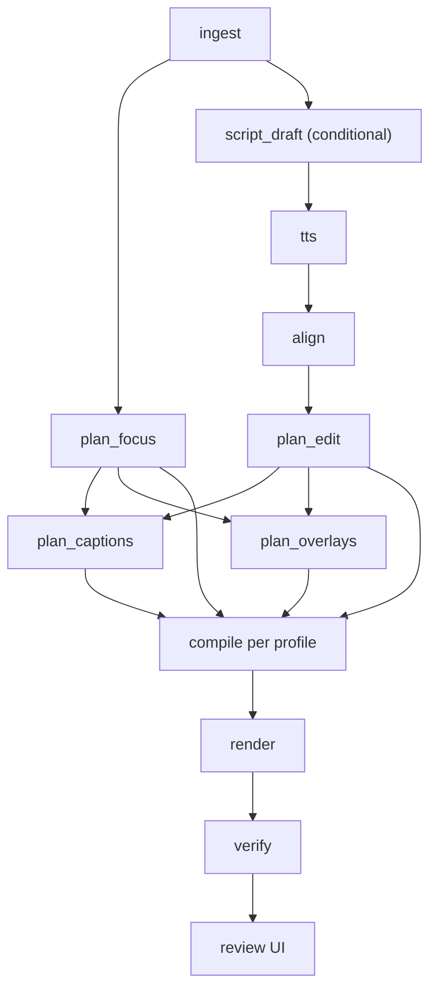

# screencut — Design & Architecture

Status: design, pre-implementation. Nothing in this document is built yet.

## 1. What this is

A pipeline that turns a raw screen recording (or a still image) into publish-ready
video: narrated, captioned, auto-zoomed, reframed for multiple aspect ratios — with a
review loop that captures corrections as structured diffs and feeds them back as
learned preferences.

**In scope:** capture ingest, narration, captioning, auto-zoom/reframe, overlay
generation, rendering, automated verification, human review, preference learning.

**Out of scope:** recording itself (an external recorder produces the input), and
publishing (the pipeline ends at a file plus a metadata sidecar; posting is manual).

### 1.1 AI-edited, not AI-generated

This is the philosophy, and it decides more design questions than any other line in this
document.

**Every frame is captured.** What appears on screen is a real recording of a real screen,
cropped, zoomed, cut, captioned and annotated — never synthesized. There is no image
model, no video model, and no B-roll generator anywhere in this system, and adding one
would not be an extension of this design but a replacement for it.

The model's job is the job of an editor: decide what to cut, where to look, what to
emphasize, what to label, what to call the thing. Those are decisions *about* captured
footage. Producing footage is not on the list.

Two boundary cases, adjudicated once so they stop being arguments:

- **Written language is in scope.** `script_draft` produces words you then perform;
  the metadata sidecar produces copy for the post. Neither is media, and neither reaches
  a frame without passing through you.
- **Your synthesized voice is in scope** (decision #20). F5-TTS cloned from your own
  reference audio, reading your own script, is performance substitution — the same
  editorial act as a re-recorded pickup line, with the same author. A stock voice or a
  voice that is not yours would not be, and is not offered.

Overlays are the case that looks like generation and is not: a fixed template set filled
with text (§6.3) is a lower-third, which is editing furniture rather than invented
content.

Single user, single style. No multi-tenancy, no auth, no billing, no job queue beyond
what one person running one job at a time needs.

## 2. Decisions

Recorded so future-us knows what was chosen deliberately versus what merely happened.

| # | Decision | Choice | Consequence |
|---|---|---|---|
| 1 | Users | Single user, one style | No tenancy/auth/quota layers. Preferences are one directory. |
| 2 | Compute location | Undecided | Every heavy stage is a CLI contract behind a `Runner`. Only `LocalRunner` gets built. |
| 3 | Renderer | FFmpeg primary, MLT export | One renderer, no parity guarantee to maintain. See §6. |
| 4 | Correction capture | Web review UI editing the spec | Corrections are structural diffs, which is what makes §10 possible. |
| 5 | Cursor events | Available from recorder | Auto-zoom and reframing are arithmetic, not inference. See §4.3. |
| 6 | Outputs | 9:16, 16:9, both from one source, stills | Forces the two-layer spec in §4.1. |
| 7 | Language | Python core, Pydantic → JSON Schema → TS | One spec definition serves validation, the UI types, *and* LLM output constraint. |
| 8 | Script source | Supplied or AI-drafted | `narration.script` is optional; absence triggers a draft stage. |
| 9 | Publishing | File on disk | No platform APIs, no OAuth, no scheduling subsystem. |
| 10 | Fixtures | Synthetic first | Ingest is an adapter boundary. See risk R1. |
| 11 | Overlays | Generated from templates per video | SVG re-renders correctly across aspect ratios; a bitmap library would not. See risk R2. |
| 12 | Autonomy | Full auto, review the finished render | Fastest feedback per job; cleanest diffs. Costs compute on bad scripts. |
| 13 | LLM interface | A coding-agent CLI, not a provider SDK | No SDK dependency, no key handling here, model is a flag. Costs constrained decoding. See §7. |
| 14 | Captions | Plain blocks first, kinetic later | Spec carries word timings from day one; only the compiler changes later. See §6.2. |
| 15 | Review UX | Form + re-render; overlay preview later | Puts the whole weight on the stage cache. See §8. |
| 16 | State | SQLite + files on disk | Media in per-job directories, records and cache index in SQLite. See §5.4. |
| 17 | Hardware | Apple Silicon | ASR backend must be swappable; cache becomes load-bearing; VideoToolbox for encode. See §16. |
| 18 | Content origin | Every frame is captured, never synthesized | No image, video, or B-roll model exists in this design. See §1.1. |
| 19 | Editorial decisions | Cuts and transcript cleanup are model stages | `plan_edit` fills the `EditSpec` in/out points nothing else produces. See §4.4. |
| 20 | Voice | F5-TTS cloned from your own reference audio | Performance substitution, not content generation — the one synthesis this design allows, and only of you. See §1.1. |

## 3. Principles

Principle 0 is §1.1 — the footage is captured, the model edits it. The four below are how
that gets enforced in code rather than asserted in prose.

1. **The spec is the system.** Planner, renderer, verifier, review UI, and learner all
   read and write one versioned document. Everything else is a detail.
2. **The model proposes; deterministic code disposes.** LLM stages emit typed,
   schema-validated spec fragments. They never emit FFmpeg arguments, never emit
   coordinates in pixels, and never render anything.
3. **Prefer arithmetic to inference.** Where a decision can be computed from data
   (cursor events, audio levels, word timings), compute it. Reserve the model for
   decisions that are genuinely about taste or language.
4. **Every stage is cacheable and replayable.** The review loop is iterative by design.
   If a caption tweak re-synthesizes the voiceover, corrections become expensive and
   the loop dies.

## 4. Core data model

### 4.1 Two layers

Producing 9:16, 16:9 and stills from one source makes a single flat spec impossible.

**`EditSpec`** — aspect-agnostic. Sources, in/out points, `FocusTrack`, narration
segments with word timings, emphasis markers, overlay intents, audio levels. All spatial
values normalized to `0.0–1.0` in source coordinates. All temporal values in seconds
from source start. **No pixels anywhere.** This is what the planner produces, what the
review UI edits, and what the learner diffs.

**`RenderProfile`** — `shorts_9x16`, `demo_16x9`, `still_4x5`. Resolution, framerate,
safe-area insets, caption box geometry and type scale, encode settings, and the
projection rule that turns a `FocusTrack` into either zoom keyframes or a crop path.

One `EditSpec` × N `RenderProfile` = N renders.

Preferences are learned **per profile**. Caption Y in vertical is a different number from
caption Y in widescreen; a single global default averages them into a value wrong for
both.

### 4.2 Versioning

`EditSpec` carries `spec_version` from the first commit, with explicit migration
functions between versions. The golden set (§11) will outlive several schema changes,
and v1 golden specs that no longer load are a golden set silently lost.

### 4.3 FocusTrack

A time series of `(t, x, y, weight, kind)` in normalized source coordinates, where
`kind` distinguishes movement, click, dwell, and manual annotation.

This single structure serves all three output types:

- **16:9 demo** — cluster clicks in time and space; emit zoom keyframes over dwell regions
- **9:16 short** — the same track becomes a crop path; vertical reframing of a widescreen
  recording is largely solved once attention position is known
- **Stills** — no cursor, so a saliency pass (or a manual point) yields a track of one or
  two entries, and Ken Burns is a pan along it

Modelling this as `FocusTrack` rather than "cursor zoom" is what makes the photo path
the degenerate case of the video path rather than a parallel implementation.

Planning from a `FocusTrack` is deterministic, governed by a handful of tunables:

| Tunable | Role |
|---|---|
| `zoom_factor` | Magnification at a dwell region |
| `min_dwell_ms` | Ignore transient cursor passes |
| `min_gap_ms` | Suppress rapid zoom oscillation |
| `ease_ms` | In/out transition duration |
| `crop_lag` | How far the 9:16 crop trails the focus point |
| `max_crop_delta_per_frame` | Ceiling that prevents judder |

Every one is a scalar the preference store can learn by median. No model participates in
the highest-impact *spatial* decision in the pipeline.

### 4.4 EditDecisions

Where `FocusTrack` answers "where do we look", `EditDecisions` answers "what survives".
It is the other half of the `EditSpec`, and under §1.1 it is the part that makes this an
editing tool rather than a captioning tool.

Two fields, both produced by `plan_edit` (§7.1):

**`cuts`** — the in/out points §4.1 always listed and nothing previously produced. A list
of `(t_in, t_out, reason)` retained segments in source time. Dead air, a fumbled restart,
the thirty seconds spent finding a menu — removed. `reason` is retained because the
review UI has to show *why* something was cut before a person can meaningfully accept it.

**`transcript_edits`** — disfluency removal as timing ranges, not as rewritten text. A
removed "um" is `(t_start, t_end, kind)`, resolved against the word timings `align`
already produces. Modelling the edit as a range rather than a replacement string is what
keeps this an edit: the audio and the caption are cut at the same instants, from the same
decision, and nothing is put into your mouth that you did not say.

Both are ordinary spec fields, which means they are diffable in review, learnable in §10
(this is what `cut pacing` refers to), and covered by the golden set. Neither is allowed
to invent a segment that is not in the source — a `t_out` beyond source duration is a
schema violation, not a judgement call.

## 5. Pipeline



`plan_focus` has no audio dependency and runs parallel to TTS. Everything else waits on
`align`, because narration timing drives caption timing and edit pacing.

`plan_edit` sits between `align` and everything downstream of it, and the ordering is
load-bearing: captions, overlays and the compiler all work in the *edited* timeline, so
cuts must be decided before anything is laid against them. Deciding cuts afterwards means
re-timing captions and re-anchoring overlays around removed ranges — the same work done
twice, and wrong the second time.

### 5.1 Stage contract

Each stage is a pure function `(inputs, params) -> artifact`, exposed as a CLI taking
JSON on stdin and file paths as arguments. This is the seam that defers decision #2:
`LocalRunner` shells out to a subprocess; a future `RemoteRunner` ships inputs to a GPU
worker and retrieves outputs. Pipeline code is identical under both.

Build only `LocalRunner`.

The seam is also what makes decision #13 cost nothing: an LLM stage is a subprocess that
happens to be a coding agent, sitting alongside the subprocesses that happen to be FFmpeg
and Whisper. There is no separate inference path in this codebase, and no second
mechanism to maintain. See §7.3.

### 5.2 Caching

Content-addressed, keyed on `(stage_name, input_hash, params_hash)`. Non-negotiable — see
principle 4.

For LLM stages, `params_hash` **must include the model identifier and a prompt version**.
The same transcript under a different model, or under a revised prompt, is a different
artifact; a key that omits them serves a stale result after exactly the change you were
trying to evaluate. This is the one cache subtlety that will not announce itself — it
looks like the prompt edit had no effect.

### 5.3 The two ASR calls are different

Conflating them is a real bug waiting to happen.

**`align`** runs WhisperX in **forced alignment** mode against the known script text. F5-TTS
does not return reliable word timestamps, so alignment is required even when the script
was supplied. Because the text is ground truth, this is substantially more accurate than
open transcription.

**`verify`** runs **open transcription** on the *final rendered audio* and diffs against the
script. Same library, opposite purpose: one produces timings, the other independently
checks that the render did not lie.

### 5.4 Persistence

Media and artifacts are files, in per-job directories. Records are rows, in SQLite.

```
data/
  jobs/<job_id>/
    source/        raw take, sidecar events
    stages/        per-stage outputs, named by cache key
    renders/       final files + metadata sidecars
    spec.json      current EditSpec
    spec.proposed.json
  screencut.db
```

SQLite holds four things, none of them large:

| Table | Purpose |
|---|---|
| `jobs` | Job record, status, spec version, degradations recorded by §7.4 |
| `stage_cache` | Cache key → artifact path, so lookup is a query and not a directory walk |
| `accepted_specs` | The learning corpus: accepted `EditSpec`s with the profile they were accepted under |
| `pref_changes` | Changelog of every learned-default move and the jobs that caused it (§10.1) |

Never put media in the database. The reason for having one at all is that both the
learner and the review UI want queries — "median `zoom_factor` over the last 20 accepted
jobs in `shorts_9x16`" is a query, and retrofitting a database once the golden set matters
is worse than starting with one.

## 6. Rendering

### 6.1 One renderer

**FFmpeg is the only renderer.** `compile` turns `EditSpec + RenderProfile` into a filter
graph. Zoom and crop become `zoompan`/`crop` expressions driven by the projected
`FocusTrack`; captions burn in from generated ASS; overlays composite from
template-rendered PNGs; audio ducking and loudness normalization run in the same graph.

**MLT XML is a one-way export, not a second renderer.** When a job needs something the
spec cannot express, export to MLT, hand-edit in Kdenlive, and re-ingest the modified XML
back into an `EditSpec`. There is deliberately **no parity guarantee** between the MLT
export and the FFmpeg render — declaring one would mean maintaining two renderers and
debugging their divergence forever. The review UI is the normal correction path;
Kdenlive is the escape hatch.

### 6.2 Captions

`plan_captions` emits `CaptionBlock`s that **always carry per-word timings**, because
`align` produces them anyway and the cost of carrying them is zero.

The first compiler renders plain timed ASS blocks and ignores the word array. Kinetic
word-highlight rendering is a later, purely-compiler-side phase: per-word ASS override
tags with active-word colouring. Because the spec already carries the data, that phase
changes no schema, invalidates no golden specs, and needs no migration.

This is the general shape to aim for — **model the end state, render the simple case** —
and it is why the load-bearing milestone in the phase plan does not have hand-authored per-word ASS
timing in its path.

### 6.3 Overlays

Overlays are **parameterized templates**, not free-form generation. A small fixed set —
callout arrow, highlight box, label chip, progress pill — rendered deterministically from
SVG to PNG at the target profile's resolution.

The LLM chooses *template + anchor + text*. It does not invent layouts. Free-form
generation would be unpredictable, untestable, and unlearnable, and under full autonomy
(#12) every instance would be discovered at review time.

## 7. LLM stages

Interface: **a coding-agent CLI** — [`hoocode`](https://github.com/kolisachint/hoocode) —
invoked through the §5.1 stage contract like any other executable (decision #13). This
codebase carries no provider SDK, no API key handling, and no bespoke inference layer.
Model selection is a flag on the subprocess, so switching models is a config change and
not a code change.

### 7.1 Which surfaces use a model

The full surface survey, not only the stages that say yes. A "no" in this table is a
design commitment that something stays deterministic — it is load-bearing, and worth as
much as the yeses.

| Surface | Model? | Rationale |
|---|---|---|
| Ingest / recorder adapter | No | Format translation. Writing the adapter is agent work; running it is not. |
| `plan_focus` | No | Arithmetic over `FocusTrack` (§4.3) |
| `plan_edit` — cuts | **Yes** | What survives is *the* editorial decision (§4.4) |
| `plan_edit` — transcript cleanup | **Yes** | Disfluency removal over word timings (§4.4) |
| `script_draft` | Yes | Language |
| `align` | No | Forced alignment (§5.3) |
| `plan_captions` — timing, layout | No | Derived from `align` output and profile geometry |
| Emphasis word selection | Yes | Taste |
| `plan_overlays` — template, anchor, text | Yes | Taste, bounded by the template set (§6.3) |
| Audio levels, ducking | No | Loudness measurement |
| `compile` | **Never** | Principle 2. No model emits an FFmpeg argument. |
| Deterministic checks (§9.1) | No | Arithmetic — and a check a model can talk its way out of is not a check |
| Transcript diff (§9.2) | Diff no, triage yes | Producing the diff is deterministic; judging a difference benign is not |
| Perceptual checks (§9.3) | Yes | Vision, and only for what text cannot answer |
| Metadata sidecar | Yes | Language |
| Review UI | No | Corrections are structural diffs — that is the entire point of §8 |
| Preference learner (§10) | No | Statistics. Auditability beats marginal accuracy. |
| Golden replay (§11) | No | Field diff with per-field tolerances |

Two rows carry most of the product's weight. `plan_edit`'s two are the stages a viewer
would actually describe as "edited"; everything above them is framing and everything below
is decoration.

### 7.2 Schema in, validated fragment out

The spec is Pydantic, so every LLM stage is the same shape: emit the JSON Schema for the
target fragment into the prompt, run the agent, parse stdout, validate against the model
that produced the schema.

```
prompt  = system + constraints.yaml + exemplars + json_schema(OverlayPlan) + job content
stdout  = hoocode -p --mode json ...
fragment = OverlayPlan.model_validate_json(extract_result(stdout))
```

One definition still does four jobs — it constrains what the prompt asks for, validates
what comes back, generates the review UI's TypeScript types, and defines what the learner
diffs.

**The honest cost of decision #13** is that the schema is now a strong instruction rather
than a decoding constraint: the agent *can* return something invalid, where a
constrained-decoding API could not. The mitigation is three lines of control flow, not a
subsystem — validate, retry once with the validation error appended, then degrade per
§7.4. Since §7.4 already mandates that degradation path for every stage, an invalid
fragment costs one extra round trip and lands somewhere the design already handles.

What is genuinely given up alongside it: provider-side prompt caching and batch
submission. For one person running one job at a time, both were cost optimizations on an
already-negligible bill.

### 7.3 Running an agent as a pipeline stage

A coding agent is built to explore and modify a repository. As a pipeline stage it must do
neither, and the invocation has to enforce that rather than request it:

- **Print mode, JSON events** — `-p --mode json`, so output is parseable and the process
  exits rather than waiting on a terminal.
- **Tools off, read-only mode.** A stage that plans captions has no business holding
  `write`, `edit`, or `bash`. hoocode's mode config (`enabled_tools`,
  `allowed_write_paths`) is where this is pinned.
- **Fixed cwd**, pointed at the job directory and nothing above it.
- **Everything the stage needs is in the prompt**, because with tools off there is no
  second way to get it.

This is a narrower thing than the agent is capable of, deliberately. The agent's full
range is for *building* screencut, which is a different activity from *running* it.

### 7.4 Failure handling

An LLM stage failure must not fail the job. Each degrades to a deterministic default and
records the degradation in the job record so review shows it. Verification still runs.

| Stage | Degrades to |
|---|---|
| `plan_edit` — cuts | No cuts; the full take survives |
| `plan_edit` — cleanup | No cleanup; verbatim transcript |
| `script_draft` | Job halts — there is no script to fall back to |
| Emphasis | No emphasis markers |
| `plan_overlays` | No overlays |
| Metadata sidecar | Script-derived title and description |

Failure here means any of: nonzero exit, unparseable stdout, schema validation failing
twice, or a timeout. Collapsing them into one "the stage did not produce a fragment"
branch is deliberate — with a subprocess boundary there is no typed exception hierarchy to
discriminate, and every one of these has the same correct response.

The degradations are chosen so that a fully-degraded job still renders: the full take, the
verbatim transcript, plain captions, no overlays. That is a worse video, not a failed one,
and it is reviewable — which matters under decision #12, where degradation is discovered
at review time rather than at a stage gate.

### 7.5 Golden-set replay

Replaying the golden set (§11) through the LLM stages is a batch of independent
subprocesses with no shared state — parallelize across cores and rate-limit to whatever
the configured provider tolerates. Nothing more sophisticated is warranted at this
corpus size.

## 8. Review UI

FastAPI serving a single page per job: the rendered video for each profile, the proposed
`EditSpec` as an editable form, and a re-render button.

Corrections are field edits. Committing writes a corrected spec, re-runs only the
invalidated stages, and re-renders. **This design puts the entire burden on the stage
cache** — if a caption-position tweak re-synthesizes narration, the loop is unusable and
the corrections that feed §10 stop happening. Cache correctness is a review-UI
requirement, not an optimization.

A later phase adds static-frame overlay preview: scrub to a frame, see captions and
overlays composited on canvas, drag to reposition, re-render only for motion and audio.
Deferred deliberately — which corrections are made most often is not yet known, and
building the preview before knowing that optimizes the wrong interaction.

Full live preview is explicitly not a goal. That is a browser NLE, which is more work
than the rest of this pipeline combined.

## 9. Verification

Three layers. The first two exist to keep garbage from reaching a person.

### 9.1 Deterministic

- Render exit clean; duration within tolerance of the spec
- Integrated loudness −14 LUFS, true peak below −1 dBTP, dialogue-to-bed ratio above threshold
- Caption blocks: no mutual overlap, minimum display duration, maximum characters per line,
  fully inside the profile's safe area
- Overlay anchors inside safe area and not occluding a caption box
- **Crop-path continuity** — no crop delta above `max_crop_delta_per_frame`
- **Cut integrity** — every `EditDecisions` segment lies inside the source, segments do
  not overlap or invert, and the retained total matches the rendered duration. This is
  the arithmetic half of trusting §4.4: it cannot tell you a cut was tasteful, but it can
  tell you the model did not hallucinate a segment that was never recorded.

That last check earns its place: judder is *the* failure mode of automated vertical
reframing, it is invisible in a still frame, and it is catchable with arithmetic.

### 9.2 Objective semantic

Open-transcribe the rendered audio and diff against the script (§5.3). One check that
catches TTS mispronunciation, audio/video desync, a wrong take, truncated narration, and
captions that drifted — all otherwise invisible until a human watches.

**§4.4 changes what this diff means, and the check has to know it.** Once `plan_edit`
removes disfluencies and cuts segments, the rendered audio is *supposed* to differ from
the raw transcript. Diffing against the raw transcript would flag every successful edit as
a failure, and a check that fires on correct behaviour gets ignored within a week.

So the diff runs against the **post-`plan_edit` expected transcript** — the script as the
spec says it should sound after cuts. Differences then fall into three classes:

| Class | Meaning |
|---|---|
| Matches expected | Pass |
| Removed range that `EditDecisions` accounts for | Expected — the edit worked |
| Anything else | Real failure — mispronunciation, desync, truncation, a cut that landed wrong |

The third class is what this check exists for, and it now also catches a failure mode that
did not previously exist: a cut applied at the wrong instant, which clips a word. That is
invisible in a still frame and audible immediately.

### 9.3 Perceptual

A VLM over sampled frames, only for questions text cannot answer: is a caption sitting on
the UI element it describes, is the zoom framing the cursor or empty space.

This goes through the same seam as every other model stage — the agent CLI accepts image
paths in print mode, so §7.3's invocation covers it with no new mechanism.

## 10. Preference learning

Three tiers, none of them fine-tuning. Volume is too low, feedback too slow, and
auditability matters more than marginal accuracy.

**Hard constraints** (`prefs/constraints.yaml`) — hand-written, never auto-modified.
Fonts, forbidden voices, fixed output dimensions.

**Learned numeric defaults** (`prefs/defaults.json`) — per render profile. Rolling median
over accepted specs for every tunable in §4.3 plus caption geometry, music level, and cut
pacing (now a real quantity — the retained-fraction and segment-length distribution over
§4.4's `cuts`). Plain statistics. Given decision #5, this tier does most of the work.

**Exemplars** (`prefs/exemplars/`) — accepted specs retrieved by similarity and few-shot
into the LLM stages. Only relevant to §7.1's model-using stages.

### 10.1 Update rules

- Never learn from a job that failed verification. A broken render's corrections poison
  the defaults.
- Require a minimum sample count before a default moves. One-off corrections are noise.
- Use a windowed median, so an old preference can be superseded.
- Every default change is written to a changelog with the jobs that caused it. "It got
  worse and nobody can explain why" is the characteristic failure of self-tuning systems.

### 10.2 Bootstrapping

With synthetic fixtures and zero accepted jobs there is nothing to learn from. Ship
hand-written values in `constraints.yaml`; the learner activates after ~10–15 accepted
real jobs. **Built earlier, it is dead code that still has to be debugged** — hence its
position late in the phase plan.

## 11. Golden set

Archived fixtures plus their approved `EditSpec`s, in `golden/`.

Renders are slow, so regression compares **specs, not pixels**: replan each fixture and
diff the proposed spec against the approved one field-by-field with per-field tolerances.
Render only two or three for frame hashing.

Any change to prompts, rules, or learned defaults replays the full set before taking
effect. Preference updates are code changes: versioned, diffable, revertable.

At least one fixture is **deliberately bad** — clipped audio, overlapping captions,
juddering crop — so §9's checks are tested against known-bad rather than only known-good.

## 12. Repository layout

```
screencut/
  spec/         Pydantic models, JSON Schema emit, migrations
  ingest/       Recorder adapters -> RawTake; synthetic fixture generator
  plan/         Deterministic planners; LLM planners
  synth/        TTS and ASR stages (CLI contracts)
  compile/      EditSpec + RenderProfile -> FFmpeg graph; MLT export; MLT re-ingest
  verify/       Deterministic checks, transcript round-trip, frame sampling
  prefs/        constraints.yaml, defaults.json, exemplars/
  review/       FastAPI + web UI
  golden/       Fixtures, approved specs, replay harness
  runner/       LocalRunner, agent-CLI adapter, cache index, SQLite schema + migrations
  docs/
data/           gitignored — per-job directories and screencut.db (§5.4)
```

## 13. Build sequence

See [`implementation-phases.md`](implementation-phases.md).

## 14. Risks

**R1 — FocusTrack rests on an unverified assumption.** The recorder is believed to export
cursor and click events, but no recording has been obtained yet, and the whole
zoom/reframe/Ken-Burns design depends on it.

*Mitigation:* `FocusTrack` is our format, not the recorder's; ingest is an adapter from
day one. Synthetic fixtures assume only sampled `(t, x, y)` plus click timestamps — the
floor any recorder could plausibly provide. Deliberately do **not** design around window
bounds, keystroke events, or scroll deltas even if the recorder turns out to expose them.
Building on the richest plausible data and receiving the poorest means rewriting the
planner; building on the floor and receiving more means extending it.

**R2 — Generated overlays under full autonomy.** The most open-ended component combined
with no stage gate.

*Mitigation:* the fixed template set in §6.3. If overlay quality is still poor at review
time, the next lever is a gate on `plan_overlays` specifically, not on the whole pipeline.

**R3 — Learner drift.** Addressed by §10.1 and §11; listed here because it is the failure
mode most likely to be noticed late.

**R4 — Cut quality is the product, and it is unproven.** §4.4 makes a model responsible
for the most consequential decision a viewer perceives. Unlike zoom (arithmetic, §4.3) or
captions (derived, §6.2), there is no deterministic fallback that is *good* — §7.4's
fallback is "keep everything", which is exactly the unedited take this project exists to
avoid.

*Mitigation:* `plan_edit` lands early (phase 5) rather than late, precisely so a bad
answer is discovered while it is still cheap to change the approach. §9.1's cut-integrity
check bounds the damage to "wrong taste" rather than "invalid spec". Cuts are ordinary
spec fields, so a bad one is a review-UI edit rather than a re-run. If taste turns out to
be the problem, the levers in order are: exemplars (§10), then a stage gate on `plan_edit`
specifically, then narrowing its remit to silence-trimming and leaving substantive cuts
manual.

**R5 — No constrained decoding.** Decision #13 trades a schema guarantee for a schema
instruction (§7.2). The plausible failure is not a wild response but a subtly wrong one —
plausible JSON that validates and is still wrong, which is a class no interface prevents.

*Mitigation:* keep fragments small and heavily typed, so there is little room between
"validates" and "correct". Normalized coordinates, enum template names, and timing ranges
bounded by source duration mean most wrong answers are *invalid* answers, caught at
§7.2's validation or §9.1's checks. This is the real reason principle 2 forbids the model
from emitting pixels or FFmpeg arguments: not that it would render badly, but that
nothing downstream could tell.

## 15. Open questions

- Review UI across profiles: one job with a shared `EditSpec` and per-profile caption
  geometry, or two independent approvals? Current lean is one job, since most corrections
  apply to the shared spec.
- Whether `still_4x5` is worth a distinct profile or whether stills reuse `shorts_9x16`.
- Whether `plan_edit`'s two halves — cuts and cleanup — are one stage or two. One stage
  sees the whole picture and decides once; two cache and degrade independently, so a bad
  cut decision does not cost you a clean transcript. Current lean is one stage emitting
  one `EditDecisions` fragment, revisited if phase 5 shows the two failing separately.
- Music beds still need a source. Templates generate visual overlays; audio has no
  equivalent, and under §1.1 the obvious shortcut — generating one — is closed. A licensed
  track is a source like any other, so this is a procurement question rather than a design
  one, but it is the one place where "no generated media" and "no source to hand" collide.

## 16. Platform notes — Apple Silicon

The target machine is Apple Silicon. Three consequences, all of which want verifying in
phase 0 rather than trusting this document.

**The transcription backend must be swappable.** WhisperX's default backend is
faster-whisper, which is built on CTranslate2 — and CTranslate2 has no Metal/MPS backend,
so on Apple Silicon it runs on CPU. `mlx-whisper` and `whisper.cpp` both have Metal
acceleration and are the likely choices here. This is exactly the payoff of the §5.1 CLI
seam: the ASR backend is a swap of one executable, not a refactor.

Note that WhisperX is two things — a transcription backend and a wav2vec2 forced-alignment
model. The alignment half is ordinary PyTorch and can use MPS; only the transcription half
has the CTranslate2 problem. They can be sourced independently.

**F5-TTS on MPS is the open question.** It is PyTorch, so it should run, but op coverage
under MPS varies and unsupported ops either fail or fall back to CPU
(`PYTORCH_ENABLE_MPS_FALLBACK=1`) at a speed cost. This is the single most likely reason
to end up wanting a remote GPU — which is what §5.1's `Runner` exists to absorb. Phase 0
answers it.

**Use VideoToolbox for encode.** FFmpeg's `h264_videotoolbox` / `hevc_videotoolbox`
hardware encoders are a straightforward render-time win on macOS. Keep a software-encode
path for the golden set, though: hardware encoders are not bit-reproducible across
machines or OS versions, and §11's frame hashing needs determinism.

**The cache stops being an optimization.** Slower local inference means the difference
between a cached and uncached correction cycle is the difference between a usable review
loop and an abandoned one.
