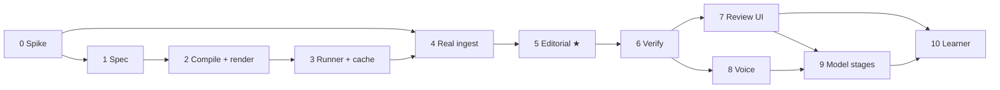

# screencut — Implementation Phases

Companion to [`architecture.md`](architecture.md), which holds the design and the
reasoning. This document holds only the order of work and what "done" means at each step.

Phase 0 has been run and phases 1 to 5 are built, with phase 6's deterministic layer among
them. Two phases carry an asterisk: phase 4 has no real take and phase 5 has never called
a model, both because of what is not installed on the machine this was built on. Each
section says so and marks which of its exit criteria that leaves open. Its measured results are in [`environment-findings.md`](environment-findings.md), and
phases 4, 5 and 8 should be read alongside it. Phases
are sized to be picked up cold: each states its goal, what gets built, how you know it is
finished, and what is deliberately excluded.

## Ordering principles

1. **Prove the load-bearing path early.** Spec → compile → render is what everything else
   hangs off. It is phase 2, before any model runs.
2. **Reach a genuinely useful tool before the riskiest dependency.** Captions over your
   own recorded voice is a real deliverable and needs no TTS — so it lands before F5-TTS,
   which is the component most likely to fight Apple Silicon (`architecture.md` §16).
3. **Prove the product claim early too.** Under `architecture.md` §1.1 this is an *editing*
   tool, and `plan_edit` is the stage that makes it one. It is phase 5 — the first model
   stage, ahead of the model stages that only decorate — because a tool that cannot cut
   well is a different project, and that is worth finding out in phase 5 rather than
   phase 9. Decision #13 is what makes this affordable: with no SDK client to build first,
   model stages can sit where they belong instead of clumping at the end.
4. **Defer anything that learns until there is something to learn from.** A learner with
   an empty corpus is dead code that still has to be debugged.
5. **Every phase ends with something runnable.** No phase is only scaffolding.

---

## Phase 0 — Environment spike — **run**

**Goal:** replace assumptions with facts before any of them is load-bearing.

**Results: [`environment-findings.md`](environment-findings.md)**, with raw measurements
under `docs/measurements/` and the harness in `tools/`.

Not a coding phase. Half a day of finding out whether the stack works on this machine —
a base-model M1 MacBook Air, 8GB, fanless (`architecture.md` §16). Two things follow for
how the measuring is done: **record peak memory alongside every timing**, because on 8GB
the number that decides a design is resident size rather than seconds; and **say whether a
timing is burst or sustained**, because a fanless machine gives two different answers and
only the sustained one governs a real job.

**Build**

- Record a real take with Cap (and/or Screenize) and try to extract cursor + click events.
  Document the actual format, sample rate, and coordinate space.
- Run each candidate ASR backend on a sample: `mlx-whisper`, `whisper.cpp`, and
  faster-whisper. Time them and record peak RSS. Confirm the CTranslate2/MPS situation
  firsthand. Do it at more than one model size — `large-v3` against `medium` — since on
  8GB the smaller model winning on wall-clock is a live possibility rather than a
  consolation prize.
- Run WhisperX's wav2vec2 alignment model under MPS. Confirm it works and time it.
- Install F5-TTS and synthesize thirty seconds. Note whether MPS works, whether
  `PYTORCH_ENABLE_MPS_FALLBACK=1` is needed, how long it takes, and peak memory. A CPU
  fallback on 8GB is also a second copy of the tensors, so the memory number is as much
  the verdict as the timing is.
- Transcribe and synthesize back to back in one process and watch for swap. This is the
  cheapest possible test of the §16 claim that stages must be serialized, and it is worth
  knowing before `LocalRunner` is written rather than after.
- Confirm `h264_videotoolbox` is available in the installed FFmpeg, and time a one-minute
  1080p encode both ways — hardware and `libx264` — since the software path is what the
  golden set pays for on every replay.
- Install hoocode and confirm the stage invocation from `architecture.md` §7.3 works:
  `-p --mode json`, tools disabled, a JSON Schema in the prompt, and a schema-valid
  fragment parsed back out of stdout. Do it once by hand with a throwaway schema. Note
  the round-trip latency — it sets the floor on every model stage.

**Exit criteria**

`docs/environment-findings.md` recording measured numbers, plus three verdicts:

- **Are cursor events extractable?** This is risk R1. A "no" invalidates the `FocusTrack`
  design and must be known now, not in phase 4.
- **Is local F5-TTS viable?** A "no" does not block anything — it means phase 8 starts by
  building `RemoteRunner`, which the stage-contract seam exists to absorb.
- **Does the agent CLI round-trip a schema reliably?** This is risk R5. A "mostly" is the
  expected answer and is fine — §7.2's validate-retry-degrade handles it. A "no" means
  reopening decision #13 before phase 5 depends on it.
- **What is the memory budget per stage?** The 8GB ceiling decides the ASR model size that
  goes into `constraints.yaml` and confirms whether local stages have to be serialized. A
  measured peak-RSS figure per stage is the deliverable; "it seemed fine" is not, because
  the failure mode is swap rather than a crash and swap looks like slowness.

**Not in this phase:** any pipeline code.

**How it came out.** Three of the four verdicts landed where the design hoped and the
fourth did not, which is roughly the intended yield of a spike.

**The measurement itself was nearly wrong.** Resident set size does not see MLX's
unified-memory allocations: mlx-whisper on `large-v3` polls at 1.3GB RSS against a 5.7GB
`phys_footprint`, a factor of 4.3. Since this phase exists because the failure mode is swap
rather than a crash, a budget built on RSS would have been built on half the truth — and it
would have picked the wrong ASR model while looking careful. The harness now wraps every
child in `/usr/bin/time -l` and reports both numbers. The tell was a nonsense result: the
"both models resident" case appeared to use *less* memory than running them one at a time.

**R1 came back better than assumed.** Cap writes cursor positions already normalized to
0..1 — `FocusTrack`'s own space — so the adapter needs no pixel conversion. But it samples
on movement, not on a clock: a resting cursor emits nothing for up to two seconds. That
turns the known dwell trap into something sharper, since dwell is not mismeasured so much
as invisible. Clicks carry no position at all, and cursor time runs on the recording clock
rather than the video's.

**F5-TTS is the "no".** 0.11x realtime on MPS and only for single-batch text; the chunked
path segfaults. CPU completes but takes ten minutes per thirty seconds of audio. Phase 8
starts with `RemoteRunner`, exactly as this phase's text anticipated.

**The toolchain fought back harder than any of the four questions.** Homebrew's `ffmpeg` no
longer depends on libass, so the repository's own phase-2 render could not run on the
target machine at all until `ffmpeg-full` was installed. That is worth knowing before
someone concludes the compiler is broken.

**And installing it exposed a second break: FFmpeg 9 removed `-filter_complex_script`,**
which `runner/stages.py` uses, so twenty tests fail with `Option not found`. The
replacement `-/filter_complex` is verified working here but is not applied — this phase
excludes pipeline code, and the swap needs a version guard since the new syntax predates
neither FFmpeg 7 nor the old option's removal cleanly. **Phase 4 fixed this first**, as a
capability probe rather than a version comparison (`compile/ffmpeg.py`).
On a clean macOS box today no single FFmpeg has both libass and
`-filter_complex_script`, so this is not optional maintenance.

---

## Phase 1 — Spec and fixtures — **built**

**Goal:** the data model everything else is written against.

**Build**

- Pydantic models: `EditSpec`, `RenderProfile` (with `duration_budget`), `FocusTrack`,
  `EditDecisions` (`removals` and tiered `segments` — `architecture.md` §4.4),
  `CaptionBlock` (carrying per-word timings from the start — §6.2), `OverlayIntent`,
  `AudioTrack`.
- `EditDecisions` validators that make an impossible edit unrepresentable: inside source
  bounds, non-inverted, non-overlapping, and **totality** — removals and segments partition
  the source with no gaps. Cheap here, and it is half of risk R5's mitigation.
- **Field-origin metadata** on every spec field: which stage produces it, and whether that
  stage is deterministic or model-backed (§11.1). No model stage exists until phase 5, but
  retrofitting this once the golden set matters means backfilling it across a schema that
  has already drifted.
- `spec_version` and a migration registry, with one no-op migration to prove the mechanism.
- JSON Schema emit + TypeScript type generation, wired to a `make` target.
- Two profiles: `shorts_9x16`, `demo_16x9`.
- Synthetic fixture generator: scripted mouse paths and click clusters producing a
  `FocusTrack`, plus a generated source video (FFmpeg `testsrc`/`lavfi` with visible
  motion) so renders are visually verifiable.

**Exit criteria**

- A fixture round-trips: construct → serialize → deserialize → equal.
- Generated TypeScript types compile.
- A migration from a hand-written v1 fixture to current loads cleanly.

**Not in this phase:** planners, rendering, anything that reads real media.

---

## Phase 2 — Compiler and render ★ — **built**

**★ The load-bearing milestone.** Everything downstream assumes this works.

**Goal:** a watchable video out of a synthetic fixture, in both aspect ratios.

**Build**

- `plan_focus`: `FocusTrack` → zoom keyframes (16:9) and crop path (9:16), with the
  tunables from `architecture.md` §4.3 read from `constraints.yaml`.
- FFmpeg compiler: `EditSpec` + `RenderProfile` → filter graph. Zoom/crop, plain ASS
  caption blocks, overlay PNG compositing, audio mix with ducking, loudness normalization.
- **The time projection** (`architecture.md` §4.5): apply `removals`, select segments by
  the profile's `duration_budget`, concatenate, remap every timing from source into edited
  time, split caption blocks at boundaries using their per-word timings, drop overlays
  landing inside removed ranges. Driven by **hand-authored** `EditDecisions` on the
  fixtures — no model, no `trim`, just the mechanism.
- SVG overlay templates (callout arrow, highlight box, label chip, progress pill) rendered
  to PNG at target resolution.
- VideoToolbox encode path plus a software-encode path for reproducible golden renders.

**Exit criteria**

- One fixture renders to both profiles and both are watchable.
- Zoom lands on the click clusters; the 9:16 crop follows the focus point without judder.
- Captions burn in, correctly timed, inside the safe area for each profile.
- A fixture with hand-authored removals renders cut, with captions trimmed at the
  boundaries and no clipped words. The same fixture under two `duration_budget` values
  produces two different lengths from one `EditSpec`.
- Software-encoded renders are byte-identical across two runs.

**Not in this phase:** kinetic captions, the cache, any model, real media.

**How it came out.** Two mechanisms rather than one, because the two projections
want different things. A crop path is a *sampled* path, so it is computed per frame
in Python and delivered through `sendcmd` to a `crop` filter whose window never
changes size. A zoom is a handful of eased regions, which is analytic, so it stays
an FFmpeg expression — and it has to, because `zoompan` accepts no commands and is
the only filter that can hold a window whose size varies. The same `sendcmd` stream
carries overlay positions (an overlay follows the point it labels, so it moves when
the crop moves) and the progress pill's fill, which is computed from output duration
exactly as §4.5 says it should be.

The trapezoid that shapes a zoom now exists twice — once as an expression, once in
Python for the overlay projection. `tests/test_compile_graph.py` evaluates the
generated expression against the Python one at quarter-second steps, because two
implementations of one formula is the pair that drifts silently.

**Why the projection is here and not in phase 5.** Cutting is a compiler capability, not a
model capability — the model only decides *what*, and §4.5 makes the compiler responsible
for *how*. Building it here means phase 5 adds a stage against a mechanism that already
demonstrably works, instead of debugging timeline remapping and model output at the same
time. It also means a hand-authored `EditDecisions` is a complete, renderable edit from
phase 2 onward, which is the manual escape hatch for any job the model gets wrong.

---

## Phase 3 — Runner, cache, and persistence — **built**

**Goal:** make re-running cheap, which is what makes the review loop possible at all.

**Build**

- Stage contract: `(inputs, params) -> artifact` as a CLI taking JSON on stdin.
- `LocalRunner` (subprocess). Define the `Runner` interface such that `RemoteRunner` is a
  drop-in; do not build it. Local-inference stages run **one at a time** — 8GB will not
  hold two models, and a runner that discovers this by swapping is a runner that looks
  merely slow (`architecture.md` §16). Stages that hold no local weights, the agent-CLI
  ones included, are exempt.
- Content-addressed cache keyed on `(stage_name, input_hash, params_hash)`, with
  `stage_version` in the key — and, for model stages, the model identifier and prompt
  version folded into `params_hash` (`architecture.md` §5.2). No model stage exists yet;
  build the key correctly anyway, because the bug it prevents is silent.
- SQLite: `jobs`, `stage_cache`, `accepted_specs`, `pref_changes` (`architecture.md` §5.4),
  with schema migrations.
- Job directory layout and a `screencut run <job>` CLI.

**Exit criteria**

- Re-running an unchanged job does no work and says so.
- Changing only caption text re-runs compile and render, and nothing upstream.
- Bumping a `stage_version` invalidates that stage and its dependents, and nothing else.

**Not in this phase:** `RemoteRunner`, distributed anything.

**How it came out.** The load-bearing decision is that **a stage fingerprints what
it reads**, not the whole spec. `plan_focus` hashes the source dimensions, the
focus track and the profile's geometry; `compile` hashes the edit and the profile
*minus* the encoder; `render` hashes the media contents and the encoder alone. So a
caption edit re-runs compile and render, and changing `crf` re-encodes without
recompiling. Hashing the spec wholesale would have been simpler and would have
made §8's argument false.

Invalidation propagates because a stage's inputs include its upstream stages'
cache keys — which is also why bumping one `stage_version` touches that stage and
its dependents and nothing beside them.

Renders are cached under their key like every other artifact and **hard-linked**
into `renders/` under a stable name. The cache stays immutable and content-
addressed, `renders/` is a view onto it, and 256GB (§16) does not stretch to two
copies of everything.

---

## Phase 4 — Real ingest and transcription ★ — **built, less the real take**

**★ First genuinely useful output.** A real recording in, a captioned auto-zoomed 9:16
short and 16:9 demo out, narrated by your own voice — with no TTS anywhere in the path.

**Goal:** stop working against fictions.

**Build**

- Recorder adapter: real cursor/click events → `FocusTrack`, written against what phase 0
  actually found. Keep it a thin adapter; `FocusTrack` stays our format.
- `transcribe` stage: ASR backend chosen in phase 0, producing word-level timings from the
  recording's own audio.
- `plan_captions`: word timings → `CaptionBlock`s, with profile-aware line breaking.
- Promote a real take into `golden/`.

**Exit criteria**

- A real recording produces both renders, unattended, from one command. — **met for a
  Cap-format recording, not a real one.** `screencut ingest <take>.cap --out <job>` then
  `screencut run <job>` (or `make take`) produces both, unattended, from a bundle in Cap's
  own format. No real take could be recorded here; see *How it came out*.
- Zoom behaviour on real cursor data is sane — this is the first test of the phase-2
  tunables against reality, and expect to retune them. — **open.** Sane on the fixture's
  cursor data, which is the fixture's data. The tunables have not met reality.
- The output is something you would actually post. If it is not, stop and fix that before
  continuing; every later phase assumes this baseline is good. — **open**, and for the
  same reason. Nothing has been posted, because nothing real has been recorded.

**Not in this phase:** synthesized voice, cuts, verification, review UI.

**How it came out.** Everything phase 0 unblocked got built, and the one thing it could
not unblock is the one thing still open: **no real take was promoted into `golden/`,**
because recording one needs a screen, a microphone and Cap on the machine doing the work.
Read the exit criteria against that. What runs instead is `ingest/cap_fixture.py`, a
bundle written in Cap's own on-disk format carrying every trap phase 0 measured at or
beyond the measured severity — a 3.6 s rest gap against the real take's 1.98 s worst case,
clicks landing inside those gaps with no position of their own, the 0.194 s clock offset,
and a sidecar claiming an fps the stream does not have. A fixture whose traps are gentler
than reality passes while the adapter is broken, so these are not.

**The first thing was the FFmpeg option, exactly as phase 0 said.** It came out as a
**capability probe rather than a version comparison**, and that was the decision inside
the ten lines. Version strings are a proxy for the thing that changed — distribution
builds carry suffixes, git builds report `N-109848-g0d1c2c9c1a` and no number at all —
while `-h full` either lists `-filter_complex_script` or does not, which is the question.
Asking the binary cannot guess wrong. The second half is less obvious: `compile` writes
the whole FFmpeg command into its manifest and `render` replays it, so a cached compile
plus a toolchain upgrade replays an option that no longer exists. The option belongs to
the binary, so `render` rewrites it and `render`'s cache key carries it.

**Reading absence as dwell turned out to need no new dwell rule.** Phase 0 sharpened the
known trap into "dwell is invisible, not mismeasured", which sounds like it wants a
special case. It does not: resampling onto a fixed grid and *holding* position across a
gap — rather than interpolating a glide that never happened — turns absence into a run of
identical samples, which is what the existing classifier already reads as dwell. One rule,
reached two ways. The four rest gaps in the fixture produce exactly four zoom regions,
each starting the moment the cursor stops.

**One caption list, sized against the tightest profile.** §4.1 has one `EditSpec` serving
N profiles and `EditSpec.captions` is part of that document, so "profile-aware line
breaking" cannot mean one list per profile. Wrapping is already per profile in
`compile/captions.py`; what `plan_captions` decides is where a block ends, and sizing that
against the narrowest box is the only answer that is one list. Blocks break on sentence
endings first, pauses second, capacity last — capacity being the fallback is the point,
because a block split only on capacity reads as cut mid-thought.

**`transcribe` and `plan_captions` are the first stages that are not per profile.** What
was said does not depend on the shape it will be rendered into, and running ASR twice for
two profiles is 23 seconds thrown away per run on the target machine. They run once per
job, ahead of the per-profile group and not interleaved with it, because they rewrite
`spec.json` and every per-profile fingerprint is taken from the spec. `transcribe` is also
the first stage to set `holds_local_weights`, which `runner/stages.py` predicted it would
be.

**Whether a job wants those stages is not in the spec, and it cannot be.** `captions: []`
means "not planned yet" in an ingested job and "this take is silent" in the next one, and
nothing in the document distinguishes them — a fixture with hand-authored captions would
be transcribed over. So `job.json` says: pipeline configuration for one run, beside
`spec.json` rather than inside it. A job directory without one is a job whose spec is
complete as given, which is every fixture in this repository, which is why adding a whole
stage group broke none of them.

**Two bugs, both found by running the first job that was not the synthetic fixture.**

An ingested take has no overlays yet, and in zoom mode that leaves the `sendcmd` script
empty — FFmpeg does not ignore a `sendcmd` with nothing to send, it refuses the graph with
"No commands were specified" and exits. The synthetic fixture always has overlays and
music, so the path had never run. Both `sendcmd` and `asendcmd` are now omitted when there
is nothing to send.

And §9.1's budget check failed every phase-4 job, correctly and uselessly: a 24 s take
against a 15 s budget overruns, and before `plan_edit` exists there is nothing to have cut
with. A check that fails on every correct job in a phase gets ignored within a week, which
is this repository's own standing warning turned on itself. It reports the overrun as a
warning while the spec carries no edit decisions at all, and as a failure once something
has proposed one.

**What could not be run here.** ASR against real speech. The stage runs end to end — audio
extraction, the phase 0 invocation, the parse, the artifact — and the parser is written
against `output_json` in whisper.cpp's own `examples/cli/cli.cpp` rather than against a
JSON shape somebody imagined. But no machine available for this work could reach the
weights, so what has been transcribed is a test tone, correctly, to no words. The
end-to-end ASR test is written against whatever `constraints.yaml` names and skips when
those weights are absent, so it runs on the target machine at `large-v3` rather than
quietly testing something smaller.

**What phase 5 inherits.** A real take, still. Both remaining exit criteria — "zoom
behaviour on real cursor data is sane" and "the output is something you would actually
post" — are judgements about footage, and the phase-2 tunables have not met reality yet.
Expect to retune them, and expect the first real recording to be where `plan_captions`'s
`PAUSE_S` and the focus weights get their first honest number.

---

## Phase 5 — Editorial pass ★ — **built, less the judgement**

**★ The product claim.** Phase 4 produces a captioned, auto-zoomed version of everything
you recorded. This is the phase where it becomes *edited* — where the dead air, the
fumbled restart and the "um" come out.

**Goal:** the first model stage, and the one the whole philosophy rests on
(`architecture.md` §1.1).

**Build**

- **`trim`** (deterministic, no model): silence and dead air from audio levels, filler
  words from a closed list against the transcript, with the §4.6 tunables in
  `constraints.yaml`. Emits proposed `removals`. **Build and evaluate this alone first** —
  it is most of the value, and knowing how much it gets right is what tells you what the
  model actually needs to do.
- Agent-CLI adapter in `runner/`: the §7.3 invocation (print mode, JSON events, tools
  disabled, fixed cwd), schema into the prompt, fragment validated back out, retry once on
  a validation error, degrade per §7.4. One adapter, reused by every later model stage —
  this is the phase that pays for phase 9.
- **`plan_edit`** (model): transcript, word timings, `trim`'s proposal and a `FocusTrack`
  summary in; final `removals` plus tiered `segments` out. It may reject any proposed
  removal, add false starts and restarts of its own, and rank what remains.
- §9.1's edit-integrity, totality and budget checks, ahead of the rest of verification,
  because they bound what a bad fragment can do.

**Exit criteria**

- `trim` alone produces a watchable video from a real take: no dead air, no fillers, no
  clipped words at the boundaries. This is the §7.4 floor, and it has to be genuinely
  acceptable on its own. — **met on the fixture, not on a real take.** `silencedetect`
  finds all four of the synthetic fixture's dead-air gaps and the closed list finds its
  one "um"; 24 s becomes 17.7 s and §9.1's `cut_mid_word` reports nothing. Whether it is
  *watchable* is a judgement about footage, and there is still no footage.
- `plan_edit` on top of it produces cuts you would have made, and its overrides of `trim`
  are defensible — check the override rate on the report (§9.1). — **open.** The stage,
  the adapter and the override rate are built and exercised against a scripted agent;
  `hoocode` is not installed on the machine this was built on, so no model has run.
- One `EditSpec` renders at two different lengths under two `duration_budget` values, and
  both are coherent — the short is not just the demo with its ending missing. — **met**,
  and with no second model call, which is the §4.4.1 half of the claim.
- Killing the network mid-job still produces a render: the `trim`-only one, all segments
  `essential`. — **met.**
- Re-running with an unchanged transcript hits the cache and calls no model. If it does not,
  phase 3's key is wrong (§5.2), and everything after this gets slow and expensive. —
  **met**, and a *degraded* run deliberately does not cache, so one lost network does not
  become permanent.

**This is a stop-and-reassess gate,** and decision #19 gives it a much better shape than a
single pass/fail: `trim` and `plan_edit` can be judged separately. If `trim` is good and
`plan_edit` adds nothing, ship `trim` and leave tiering manual — that is a real product.
If `trim` itself is wrong, that is tunables in `constraints.yaml`, not an architecture
problem. Work R4's levers in order and do not carry a bad `plan_edit` forward on the
assumption that later phases improve it. They do not; they decorate it.

**Not in this phase:** emphasis, overlays, metadata — those are phase 9, and they are
decoration on top of this.

**How it came out.** The stop-and-reassess gate cannot be walked through here, and that is
the honest headline: `hoocode` is not installed on the machine this was built on, so
`plan_edit` has never called a model. Everything around it is built and exercised — the
adapter, the reconciliation, the cache key, the override rate, and §7.4's degradation —
against a script on `PATH` that emits the event stream hoocode emits, fence and all. That
tests our code end to end and tests nothing about editorial taste, which is the half the
gate is actually for.

**`trim` is better than the plan gave it credit for, and the reason is `silencedetect`.**
Measuring the audio rather than inferring silence from gaps in the transcript is the
difference between a mechanism and a heuristic: a gap in the words is not a gap in the
sound, and a long "uhhhh" is one and not the other. On the synthetic fixture it finds all
four dead-air gaps to within 20 ms of where the generator put them.

**Three rules in `trim`, each written after it cut something it should not have.** A range
with words in it is not dead air whatever the meter says — someone speaking quietly reads
as silence at any threshold loose enough to catch real dead air, so ASR wins and the
silence is clipped around the words. `keep_pad_ms` *shrinks* a removal rather than growing
it, because a cut at the level threshold clips the breath before the next word. And
removals merge, because a filler landing against a silence would otherwise leave a 40 ms
segment that §4.4's totality makes real, selectable and reviewable.

**The filler list is deliberately short.** "so", "like", "right" and "actually" are fillers
about half the time and ordinary words the other half. A list cannot tell which, and
stripping every one of them mangles speech — judging that is exactly what §7.1 pays
`plan_edit` for, so the list stays unambiguous and the model gets the ambiguous half.

**The model returns intent; the partition is derived.** This is the decision the plan did
not contain. `EditDecisions` demands a gapless, non-overlapping cover of exactly
`[0, duration]`, and asking a language model to land that in float arithmetic buys a retry
on nearly every call for no editorial gain. So the fragment carries removals and tiered
segments as ranges the model cares about, and `reconcile` derives the total partition:
removals win, segments are clipped to what is left, and anything nobody tiered stays
`essential`. §4.4's totality still holds by construction — it is arithmetic that holds it,
which is §4.5's discipline applied one level up.

**`proposed_by` is derived rather than reported,** for the same reason. A removal
overlapping one of `trim`'s proposals came from `trim` whatever the model says, and the
§9.1 override rate is a number about the model that the model therefore cannot write about
itself.

**No `duration_budget` reaches the prompt, and that is §4.4.1 doing real work.** Putting
budgets in front of the model would make the ranking depend on the profile — and then one
`EditSpec` could not render at two lengths, a shorter short would cost a model call, and
the cache key of the most expensive stage in the pipeline would move whenever somebody
adjusted a number the compiler owns.

**A degraded artifact is not cached.** §7.4 says a failed LLM stage degrades and the job
records it; it does not say what the cache should do, and the obvious answer is wrong.
Caching the fallback makes one lost network permanent — the next run, with the network
back, serves the degraded artifact forever. The file is still written so the job finishes;
the missing cache row is what makes the next run try the model again.

**What `trim` alone gets wrong, and why it is left wrong.** Cutting "um" out of the middle
of "so um clicking through…" leaves "so" as a 0.54 s caption block of its own, which §9.1
duly warns about. The deterministic fix — extend a removal to swallow a fragment too short
to display — depends on `min_display_s`, which is per profile, and tiering is supposed to
be aspect-independent. So it is left for `plan_edit`, which under §7.1 is allowed to widen
a proposed removal and is the stage that should be making that call.

**What phase 6 and 7 inherit.** The judgement half of this gate, still: a real take, a
model that has actually run on it, and someone deciding whether the cuts are ones they
would have made. Until that happens, `trim` is the product and `plan_edit` is untested
polish on top of it — which, per decision #19, is a real shipping position rather than a
failure.

---

## Phase 6 — Verification — **deterministic layer built**

**Goal:** stop garbage reaching a person.

**Built out of order, and deliberately.** §9.1's checks need a spec, a profile and
a render, and nothing else — not real media, not a model. They were pulled forward
because they are what will catch problems on the *first* real recording, which is
when nobody yet knows what to look for. §9.2's transcript round-trip and §9.3's
perceptual layer stay where they are: both need something phase 0 has not chosen
yet.

**Build**

- Deterministic checks (`architecture.md` §9.1): render integrity, duration, loudness and
  true peak, caption overlap / duration / line length / safe area, overlay occlusion,
  crop-path continuity. Edit integrity, totality and budget already exist from phase 5;
  fold them into the same report.
- Transcript round-trip: open-transcribe the rendered audio, diff against the
  **expected transcript** computed per profile from the spec (source minus removals, minus
  segments below this profile's threshold — §9.2), classify each difference into the three
  classes, report WER over the third only. Diffing against the raw transcript would flag
  every successful phase-5 edit as a failure.
- A verification report per render, stored on the job record.
- At least one **deliberately broken** fixture — clipped audio, overlapping captions,
  juddering crop, and a cut landing mid-word — added to `golden/`.

**Exit criteria**

- Every check fires on the broken fixture and none fires on the good one.
- A correctly edited job reports zero real differences despite the rendered audio
  differing from the raw transcript. This is the check on the check, and it is the one
  that decides whether §9.2 stays useful once phase 5 exists.
- The report is legible enough to act on without reading the code.

**Not in this phase:** the VLM perceptual layer. Add it once you know which real failures
the deterministic checks miss.

**How it came out.** `verify` is a pipeline stage like any other, so a report is
cached, keyed and invalidated with everything else, and `screencut run` prints it.
The report is a list of findings rather than a verdict, because §9.1's most useful
outputs are numbers — the budget overrun in seconds, the trim composition — and a
check that can only say no cannot say "7.4 seconds over".

Two of §11's four breakages turned out to be **unrepresentable**: `EditSpec`
refuses overlapping caption blocks and `plan_focus` rate-limits the crop by
construction. Their checks stay, exercised against hand-built inputs, because the
thing that makes them impossible today is code that can change. The broken fixture
carries the two a spec can still express, plus an overlay that occludes a caption.

The checks paid for themselves before they were finished. Running them on the good
fixture failed twice for real reasons: overlays placed a pixel outside the safe
area because a normalized inset was rounded to pixels in two places that disagreed,
and the fixture's own highlight box sat on top of the caption. The first is fixed by
one shared rounding helper; the second by moving the fixture's target, because a
good fixture has to actually be good or the check fires every run and gets ignored
within a week.

---

## Phase 7 — Review UI

**Goal:** capture corrections as structural diffs.

**Build**

- FastAPI app, one page per job: rendered video per profile, verification report, the
  proposed `EditSpec` as an editable form, re-render button.
- Edit review specifically: `removals` grouped by `kind` and `segments` with their tier and
  `reason` (§4.4), so a removal can be reinstated or a segment re-tiered without leaving
  the form — plus the profile's `duration_budget` as a directly editable number, since
  "make the short shorter" is one field rather than a dozen re-tierings. These corrections
  are the phase-5 feedback signal and the input to §10's budget defaults.
- Any §7.4 degradation shown prominently. Under decision #12 this page is the only place a
  degraded job announces itself.
- Accept / reject, writing accepted specs and the proposed→corrected diff to SQLite.
- Generated TypeScript types from phase 1 wired into the frontend.

**Exit criteria**

- A correction round trip — edit, re-render, accept — completes in seconds, not minutes,
  because the cache holds.
- Adjusting a removal, a tier, or a budget re-runs compile and render and **re-runs no
  planner at all** — not `plan_edit`, not `plan_captions`, not `plan_overlays`. This is
  §4.5's whole payoff, and if it does not hold, the review loop costs a model call per
  correction and will be abandoned.
- `accepted_specs` and the diff record populate correctly.

**Not in this phase:** overlay preview, live playback.

---

## Phase 8 — Voice synthesis

**Goal:** narration from a script rather than from your microphone.

Deliberately after phase 4: everything before this is useful without it, and phase 0 has
already established whether this runs locally.

This is the one synthesis the design permits, and decision #20 is what permits it — your
voice, your script, your reference audio. That boundary is a schema-and-config matter, not
a matter of intent, so make it one: the voice reference is a required, per-job, explicitly
recorded input, not a default that can be quietly pointed at someone else.

**Build**

- `tts` stage: F5-TTS behind the CLI contract. If phase 0 said local is impractical, this
  is where `RemoteRunner` gets built instead — and on a base-model M1 Air that is a real
  branch rather than a formality, so read phase 0's memory and sustained-speed numbers
  before starting rather than after.
- `align` stage: WhisperX **forced alignment** against the known script text — a different
  mode from phase 4's open transcription (`architecture.md` §5.3).
- Script as an optional job input; music bed mixing and ducking against synthesized narration.
- Voice-reference handling, with an explicit consent note in the job record.

**Exit criteria**

- Script in, narrated and captioned video out.
- Phase 6's transcript round-trip passes on synthesized narration — this is the check that
  catches TTS mispronunciation, and it is the reason verification comes first.
- `plan_edit`'s cleanup half no-ops on synthesized narration, which has no disfluencies to
  remove. If it starts cutting clean speech, that is a phase-5 prompt problem surfacing on
  new input, and it is worth knowing before the learner starts averaging over it.

---

## Phase 9 — Remaining model stages

**Goal:** the taste and language decisions, bounded by schema.

The adapter, the retry path, and the degradation path all exist from phase 5. This phase
is four stages against a seam that already works, which is the whole reason it is small.

**Build**

- `script_draft`, emphasis selection, `plan_overlays`, metadata sidecar — each returning a
  Pydantic-validated spec fragment through the phase-5 adapter (`architecture.md` §7.2).
- Per-stage prompt and model configuration: these stages differ in how much thinking they
  deserve, and model choice is a flag (decision #13). Overlay placement is not script
  drafting.
- Degradation paths per §7.4's table, extended to cover the four new stages.
- Golden-set replay split by field origin (§11.1): strict single-run tolerances on
  deterministic fields, distributional over N runs on model-written ones. Parallelized per
  §7.5. The origin metadata came from phase 1, so this is a harness rather than a
  schema change.

**Exit criteria**

- Every model stage returns a validated fragment or degrades cleanly; killing the network
  mid-job still produces a render — now a cut, cleaned, captioned one rather than a raw take.
- Golden-set replay runs and reports per-field spec drift.
- Schema-violation rate across a replay is recorded. This is the first real measurement of
  risk R5, and it is the number that says whether decision #13 was right.

---

## Phase 10 — Preference learner

**Goal:** close the loop.

Requires ~10–15 accepted real jobs in `accepted_specs`. If they do not exist yet, this
phase is not ready — go and make videos instead.

**Build**

- Numeric defaults: windowed median per tunable per profile, with a minimum sample count —
  the §4.3 focus tunables, the §4.6 trim tunables, and each profile's `duration_budget`,
  which is what "cut pacing" concretely means (`architecture.md` §10).
- Exemplar retrieval feeding the phase-5 and phase-9 stages. `plan_edit` benefits most:
  accepted tier assignments are the closest thing this system has to a record of your
  taste, and they are the first lever in risk R4.
- Learner emits a **proposed** diff to `defaults.json` for approval; never auto-applies.
- Every accepted change written to `pref_changes` with its causing jobs.
- Golden-set replay gating: a preference change that moves golden specs beyond tolerance
  is surfaced before it can be accepted.

**Exit criteria**

- Correcting zoom factor the same way across several jobs produces a proposal to move the
  default, and the changelog explains which jobs caused it.
- Shortening `shorts_9x16` by hand across several jobs proposes a lower `duration_budget`
  for that profile and leaves `demo_16x9` untouched. Per-profile learning is the reason
  §4.1 has two layers, and the budget is where it pays off most visibly.
- A job that failed verification contributes nothing.
- Reverting a preference change restores prior planning behaviour exactly.

---

## Later phases

Unordered. Pull them in when the need is felt, not on a schedule.

| Phase | Trigger |
|---|---|
| **Kinetic captions** | When plain blocks look too plain for shorts. Purely a compiler change — the spec already carries word timings, so no migration and no golden-spec churn. |
| **Overlay preview in review UI** | When you know which corrections you make most often and can optimize for them. |
| **VLM perceptual verification** | When real failures are slipping past the deterministic checks. Goes through the phase-5 adapter — the agent CLI takes image paths in print mode, so there is no new mechanism to build. |
| **MLT export and re-ingest** | The first time you want Kdenlive for something the spec cannot express. |
| **`still_4x5` profile** | When photo posts are actually being made; may turn out that `shorts_9x16` suffices. |
| **`RemoteRunner`** | When local inference becomes the bottleneck, or phase 0/8 forces it earlier. |
| **Multi-take assembly** | When re-recording a section and stitching it in is something you actually want (decision #24). A `source_id` on `removals` and `segments`, plus a compiler that concatenates across takes — a schema migration and a compiler change, not a redesign. |

---

## Dependency graph

Phases 7 and 8 are independent of each other and can be done in either order. Everything
else is a hard dependency.

Three ★ milestones, and they answer three different questions. Phase 2 asks *can it
render*. Phase 4 asks *is it useful*. Phase 5 asks *is it the thing we said it was* — and
that one is the only one whose answer can send you back to the drawing board rather than
back to the code.
