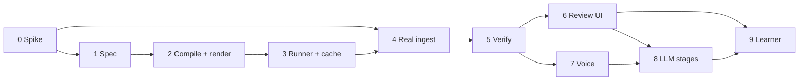

# screencut — Implementation Phases

Companion to [`architecture.md`](architecture.md), which holds the design and the
reasoning. This document holds only the order of work and what "done" means at each step.

Nothing here is built yet. Phases are sized to be picked up cold: each states its goal,
what gets built, how you know it is finished, and what is deliberately excluded.

## Ordering principles

1. **Prove the load-bearing path early.** Spec → compile → render is what everything else
   hangs off. It is phase 2, before any model runs.
2. **Reach a genuinely useful tool before the riskiest dependency.** Captions over your
   own recorded voice is a real deliverable and needs no TTS — so it lands before F5-TTS,
   which is the component most likely to fight Apple Silicon (`architecture.md` §16).
3. **Defer anything that learns until there is something to learn from.** A learner with
   an empty corpus is dead code that still has to be debugged.
4. **Every phase ends with something runnable.** No phase is only scaffolding.

---

## Phase 0 — Environment spike

**Goal:** replace assumptions with facts before any of them is load-bearing.

Not a coding phase. Half a day of finding out whether the stack works on this machine.

**Build**

- Record a real take with Cap (and/or Screenize) and try to extract cursor + click events.
  Document the actual format, sample rate, and coordinate space.
- Run each candidate ASR backend on a sample: `mlx-whisper`, `whisper.cpp`, and
  faster-whisper. Time them. Confirm the CTranslate2/MPS situation firsthand.
- Run WhisperX's wav2vec2 alignment model under MPS. Confirm it works and time it.
- Install F5-TTS and synthesize thirty seconds. Note whether MPS works, whether
  `PYTORCH_ENABLE_MPS_FALLBACK=1` is needed, and how long it takes.
- Confirm `h264_videotoolbox` is available in the installed FFmpeg.

**Exit criteria**

`docs/environment-findings.md` recording measured numbers, plus two verdicts:

- **Are cursor events extractable?** This is risk R1. A "no" invalidates the `FocusTrack`
  design and must be known now, not in phase 4.
- **Is local F5-TTS viable?** A "no" does not block anything — it means phase 7 starts by
  building `RemoteRunner`, which the stage-contract seam exists to absorb.

**Not in this phase:** any pipeline code.

---

## Phase 1 — Spec and fixtures

**Goal:** the data model everything else is written against.

**Build**

- Pydantic models: `EditSpec`, `RenderProfile`, `FocusTrack`, `CaptionBlock` (carrying
  per-word timings from the start — `architecture.md` §6.2), `OverlayIntent`, `AudioTrack`.
- `spec_version` and a migration registry, with one no-op migration to prove the mechanism.
- JSON Schema emit + TypeScript type generation, wired to a `make` target.
- Two profiles: `shorts_9x16`, `demo_16x9`.
- Synthetic fixture generator: scripted mouse paths and click clusters producing a
  `FocusTrack`, plus a generated source video (FFmpeg `testsrc`/`lavfi` with visible
  motion) so renders are visually verifiable.

**Exit criteria**

- A fixture round-trips: construct → serialize → deserialize → equal.
- Generated TypeScript types compile.
- A migration from a hand-written v1 fixture to current loads cleanly.

**Not in this phase:** planners, rendering, anything that reads real media.

---

## Phase 2 — Compiler and render ★

**★ The load-bearing milestone.** Everything downstream assumes this works.

**Goal:** a watchable video out of a synthetic fixture, in both aspect ratios.

**Build**

- `plan_focus`: `FocusTrack` → zoom keyframes (16:9) and crop path (9:16), with the
  tunables from `architecture.md` §4.3 read from `constraints.yaml`.
- FFmpeg compiler: `EditSpec` + `RenderProfile` → filter graph. Zoom/crop, plain ASS
  caption blocks, overlay PNG compositing, audio mix with ducking, loudness normalization.
- SVG overlay templates (callout arrow, highlight box, label chip, progress pill) rendered
  to PNG at target resolution.
- VideoToolbox encode path plus a software-encode path for reproducible golden renders.

**Exit criteria**

- One fixture renders to both profiles and both are watchable.
- Zoom lands on the click clusters; the 9:16 crop follows the focus point without judder.
- Captions burn in, correctly timed, inside the safe area for each profile.
- Software-encoded renders are byte-identical across two runs.

**Not in this phase:** kinetic captions, the cache, any model, real media.

---

## Phase 3 — Runner, cache, and persistence

**Goal:** make re-running cheap, which is what makes the review loop possible at all.

**Build**

- Stage contract: `(inputs, params) -> artifact` as a CLI taking JSON on stdin.
- `LocalRunner` (subprocess). Define the `Runner` interface such that `RemoteRunner` is a
  drop-in; do not build it.
- Content-addressed cache keyed on `(stage_name, input_hash, params_hash)`, with
  `stage_version` in the key.
- SQLite: `jobs`, `stage_cache`, `accepted_specs`, `pref_changes` (`architecture.md` §5.4),
  with schema migrations.
- Job directory layout and a `screencut run <job>` CLI.

**Exit criteria**

- Re-running an unchanged job does no work and says so.
- Changing only caption text re-runs compile and render, and nothing upstream.
- Bumping a `stage_version` invalidates that stage and its dependents, and nothing else.

**Not in this phase:** `RemoteRunner`, distributed anything.

---

## Phase 4 — Real ingest and transcription ★

**★ First genuinely useful output.** A real recording in, a captioned auto-zoomed 9:16
short and 16:9 demo out, narrated by your own voice — with no TTS anywhere in the path.

**Goal:** stop working against fictions.

**Build**

- Recorder adapter: real cursor/click events → `FocusTrack`, written against what phase 0
  actually found. Keep it a thin adapter; `FocusTrack` stays our format.
- `transcribe` stage: ASR backend chosen in phase 0, producing word-level timings from the
  recording's own audio.
- `plan_captions`: word timings → `CaptionBlock`s, with profile-aware line breaking.
- Promote a real take into `golden/`.

**Exit criteria**

- A real recording produces both renders, unattended, from one command.
- Zoom behaviour on real cursor data is sane — this is the first test of the phase-2
  tunables against reality, and expect to retune them.
- The output is something you would actually post. If it is not, stop and fix that before
  continuing; every later phase assumes this baseline is good.

**Not in this phase:** synthesized voice, verification, review UI.

---

## Phase 5 — Verification

**Goal:** stop garbage reaching a person.

**Build**

- Deterministic checks (`architecture.md` §9.1): render integrity, duration, loudness and
  true peak, caption overlap / duration / line length / safe area, overlay occlusion,
  crop-path continuity.
- Transcript round-trip: open-transcribe the rendered audio, diff against the script, report WER.
- A verification report per render, stored on the job record.
- At least one **deliberately broken** fixture — clipped audio, overlapping captions,
  juddering crop — added to `golden/`.

**Exit criteria**

- Every check fires on the broken fixture and none fires on the good one.
- The report is legible enough to act on without reading the code.

**Not in this phase:** the VLM perceptual layer. Add it once you know which real failures
the deterministic checks miss.

---

## Phase 6 — Review UI

**Goal:** capture corrections as structural diffs.

**Build**

- FastAPI app, one page per job: rendered video per profile, verification report, the
  proposed `EditSpec` as an editable form, re-render button.
- Accept / reject, writing accepted specs and the proposed→corrected diff to SQLite.
- Generated TypeScript types from phase 1 wired into the frontend.

**Exit criteria**

- A correction round trip — edit, re-render, accept — completes in seconds, not minutes,
  because the cache holds.
- `accepted_specs` and the diff record populate correctly.

**Not in this phase:** overlay preview, live playback.

---

## Phase 7 — Voice synthesis

**Goal:** narration from a script rather than from your microphone.

Deliberately after phase 4: everything before this is useful without it, and phase 0 has
already established whether this runs locally.

**Build**

- `tts` stage: F5-TTS behind the CLI contract. If phase 0 said local is impractical, this
  is where `RemoteRunner` gets built instead.
- `align` stage: WhisperX **forced alignment** against the known script text — a different
  mode from phase 4's open transcription (`architecture.md` §5.3).
- Script as an optional job input; music bed mixing and ducking against synthesized narration.
- Voice-reference handling, with an explicit consent note in the job record.

**Exit criteria**

- Script in, narrated and captioned video out.
- Phase 5's transcript round-trip passes on synthesized narration — this is the check that
  catches TTS mispronunciation, and it is the reason phase 5 comes first.

---

## Phase 8 — LLM stages

**Goal:** the taste and language decisions, bounded by schema.

**Build**

- Anthropic client wrapper: `claude-opus-5`, adaptive thinking, per-stage `effort`,
  prompt-caching layout, typed exception chain, `stop_reason` and refusal-fallback handling.
- `script_draft`, emphasis selection, `plan_overlays`, metadata sidecar — each returning a
  Pydantic-validated spec fragment via `messages.parse` (`architecture.md` §7.2).
- Degradation paths: an LLM stage failure produces the deterministic default and records
  the degradation, never fails the job.
- Golden-set replay through the Message Batches API.

**Exit criteria**

- Every LLM stage returns a validated fragment or degrades cleanly; killing the network
  mid-job still produces a render.
- `usage.cache_read_input_tokens` is nonzero across repeated runs.
- Golden-set replay runs and reports per-field spec drift.

---

## Phase 9 — Preference learner

**Goal:** close the loop.

Requires ~10–15 accepted real jobs in `accepted_specs`. If they do not exist yet, this
phase is not ready — go and make videos instead.

**Build**

- Numeric defaults: windowed median per tunable per profile, with a minimum sample count.
- Exemplar retrieval feeding the phase-8 stages.
- Learner emits a **proposed** diff to `defaults.json` for approval; never auto-applies.
- Every accepted change written to `pref_changes` with its causing jobs.
- Golden-set replay gating: a preference change that moves golden specs beyond tolerance
  is surfaced before it can be accepted.

**Exit criteria**

- Correcting zoom factor the same way across several jobs produces a proposal to move the
  default, and the changelog explains which jobs caused it.
- A job that failed verification contributes nothing.
- Reverting a preference change restores prior planning behaviour exactly.

---

## Later phases

Unordered. Pull them in when the need is felt, not on a schedule.

| Phase | Trigger |
|---|---|
| **Kinetic captions** | When plain blocks look too plain for shorts. Purely a compiler change — the spec already carries word timings, so no migration and no golden-spec churn. |
| **Overlay preview in review UI** | When you know which corrections you make most often and can optimize for them. |
| **VLM perceptual verification** | When real failures are slipping past the deterministic checks. |
| **MLT export and re-ingest** | The first time you want Kdenlive for something the spec cannot express. |
| **`still_4x5` profile** | When photo posts are actually being made; may turn out that `shorts_9x16` suffices. |
| **`RemoteRunner`** | When local inference becomes the bottleneck, or phase 0/7 forces it earlier. |

---

## Dependency graph

Phases 6 and 7 are independent of each other and can be done in either order. Everything
else is a hard dependency.
